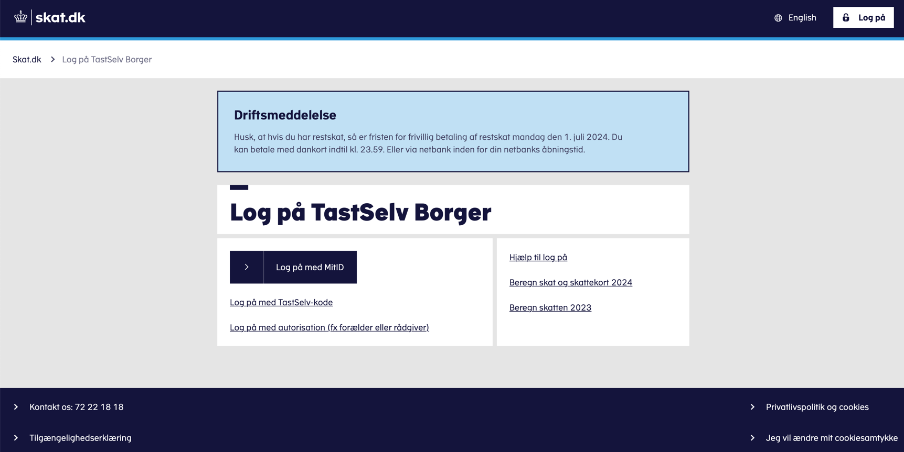
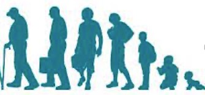
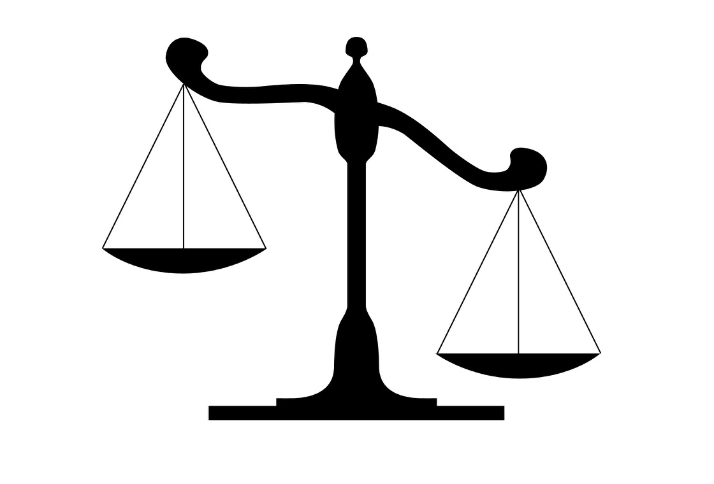
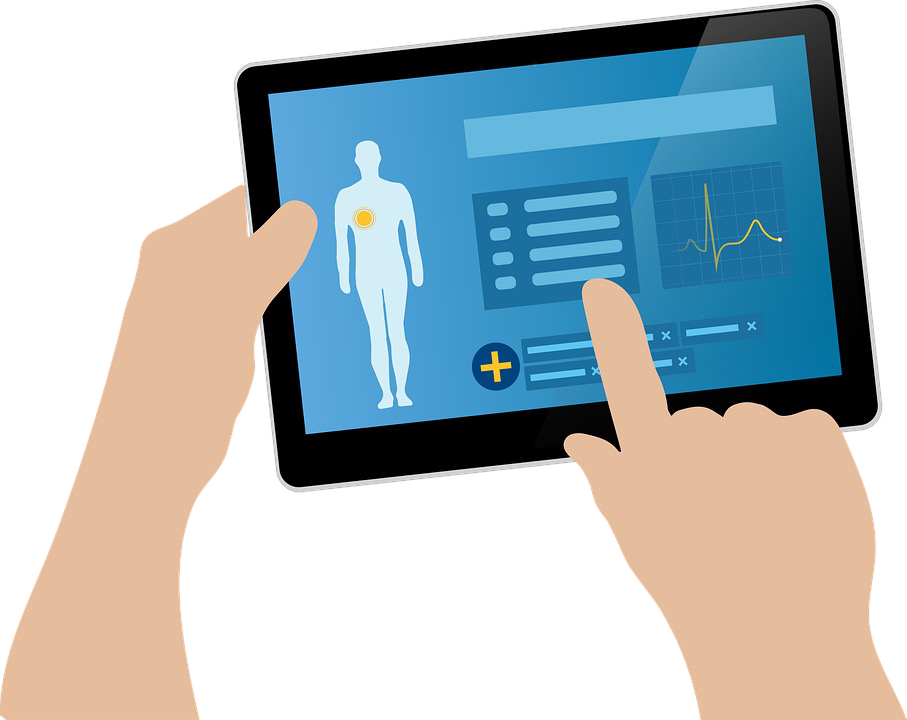

<!-- Slide 1 -->

Prof. Brit Ross Winthereik

The organizational 
context

From Analytics to Action
1
February 9, 2026

Technical University of Denmark

---

<!-- Slide 2 -->

The overall problem

• Many data, AI, and ICT projects work technically but fail organizationally

• Engineering solutions often assume: 
–Better data → better decisions 
–Better systems → better behavior

• Claim: Technical systems and analytics do not create better performance 
on their own – organizations do!

Technical University of Denmark

From Analytics to Action
2

---

<!-- Slide 3 -->

Technical University of Denmark
Date
Title
3

---

<!-- Slide 4 -->

Technical University of Denmark

Title

---

<!-- Slide 5 -->

Technical University of Denmark

5

---

<!-- Slide 6 -->

Date
Title
6

Technical University of Denmark

---

<!-- Slide 7 -->

The organisational challenge

Mission

Regulation

Strategy

Coordination

Operations

Digital Optur
7
25. april 2025

Technical University of Denmark

---

<!-- Slide 8 -->

The accountability sink

From Analytics to Action
8
February 9, 2026

Technical University of Denmark

---

<!-- Slide 9 -->

Remember the organization when fixing immediate 
problems in the data-driven organization

Phishing emails 
account for 15% of all

People stop clicking 
and reduce the risk of

data breaches

hacker attacks

Problem
Solution

Technical University of Denmark

From Analytics to Action
9

---

<!-- Slide 10 -->

Possible actions and trade offs

• Put on hefty spam filters at the risk that employees loose out on 
information.
• Punish people who do it at the risk of loosing trust in management.
• Train them to recognize it at the risk of efficiency.
• Identify the segment who has the riskiest behavior at the risk of 
wrongfully shaming individuals.

Technical University of Denmark

From Analytics to Action
10

---

<!-- Slide 11 -->

Definition of “trade-off”

“A decision where you give up one thing in 
order to gain something else, often involving 
a balance between different factors. It reflects 
the idea that choosing one option typically 
means sacrificing another.”

From Analytics to Action
11
Date

Technical University of Denmark

---

<!-- Slide 12 -->

Today’s lecture

1. Start with three real organizational

examples to illustrate the role of 
organizational context for performance 
and technology use.

2. Introduce how to use core concepts:

affordance, invisible work, 
organizational fabric to understand the 
organizational context.

3. Explain how to move from

understanding the organizational 
context to better decision-making.

From Analytics to Action
12
Date

Technical University of Denmark

---

<!-- Slide 13 -->

Organization and technology co-produce each 
other

Co-production refers to the simultaneous processes through which 
society and scientific knowledge influence and shape each other.

In a company it emphasizes that everyday norms and routines and 
systems evolve together, highlighting the interconnectedness of 
organisation and technology.

(Jasanoff, 2004, States of Knowledge: The Co-Production of Science and Social Order)

From Analytics to Action
13
February 9, 2026

Technical University of Denmark

---

<!-- Slide 14 -->

Example 1: Affordance

• Definition of affordance: Is what the 
environment offers to a person or a 
group of employees.

• Case: To use data managers must trust 
data, but data are entered by different 
professional groups, who use different 
standards and have different routines.

• How to turn the electronic medical record 
into an environment for trustworthy 
data?

• Consider the relation between 
technology, users and organizational 
context, ie standards and work routines.

From Analytics to Action
14
February 9 2026

Technical University of Denmark

---

<!-- Slide 15 -->

Exercise: Affording trust in data

• Trust in data is crucial for the hospital management to use data for 
decision-making but the data are entered by different professional groups 
using different standards and routines. As a result, the data are not 
trusted.
• Think of one change to either standards or work routines to afford trust in 
data.

From Analytics to Action
15
February 9 2026

Technical University of Denmark

---

<!-- Slide 16 -->

Example 2: Invisible work

• Definition of invisible work: Activities that are 
informal, unaccounted for and under-valued, but 
nevertheless keeps organizational performance 
on track.

• Case: Connecting data sets, data cleaning, 
compensating for missing data to keep systems 
running and enable data quality.

• How to support these invisible tasks? If work is 
invisible, it cannot be designed for?

• “Accountability drains” and lack of 
organizational learning and innovation.

From Analytics to Action
16
February 9 2026

Technical University of Denmark

---

<!-- Slide 17 -->

Exercise: Supporting invisible work in data 
analysis

• Consider the invisible work involved in preparing data for analysis.
• How might managers better recognize and support such tasks 
without knowing the exact details (of this work, don’t propose 
making it visible)?
• How can organizational elements such as time allocation, 
coordination, and collaboration play a role?

From Analytics to Action
17
February 9 2026

Technical University of Denmark

---

<!-- Slide 18 -->

Example 3: The organizational fabric

• Definition of organizational fabric: Intertwined 
social and technical threads to understand 
organizations through organizing processes.

• Case: Algorithmic management systems in large 
companies spanning multiple sites inefficient.

• Implementation of technology is an ongoing 
process that makes organizations.

• Consider the impact of power structures (different 
positions in hierarchies) and access to 
technologies on organizing.

From Analytics to Action
18
February 9 2026

Technical University of Denmark

---

<!-- Slide 19 -->

Example 3: The organizational fabric

• Consider the dashboard as a tool for managers to gain overview 
and monitor company performance.
• Using the case example what risks are involved in relying on 
dashboards for real-time monitoring of tasks?
• What can be done to mitigate those risks?

From Analytics to Action
19
February 9 2026

Technical University of Denmark

---

<!-- Slide 20 -->

Technological fixes won’t save bad company 
performance

• When technology does not work as a 
solution to a problem, the problem may 
be socio-technical. 
• “a technical fix” – often used to explain 
attempts to solve a sociotechnical 
problem, where there is little attention to 
the organizational or social elements of 
the problem.
• A socio-technical approach attends to 
– Processes
– Relations across technology, people,

standards etc.

Technical University of Denmark

From Analytics to Action
20

---

<!-- Slide 21 -->

Redesign relation between problem and solution

Problem

Solution

• Little trust in data
• Lack of innovation
• No productivity gains

• Training of employees
• Change expectations 
• Allow for variation
• Introduce quality measures across the 
organization
• Feedback mechanisms to ensure 
organizational learning
• Different workflows
• Attention to power structures

From Analytics to Action
21
February 9 2026

Technical University of Denmark

---

<!-- Slide 22 -->

Technical University of Denmark

From Analytics to Action