<!-- Slide 1 -->

Analytics to Action
Datafication
(+ a few announcements)

Anders Koed Madsen, February, 2026

---

<!-- Slide 2 -->

A few announcements before we start

You have now been allocated a group and assigned a case.

a.
Not all of you have gotten your preferred case - but we 
are sure that you’ll learn much from the case you got. 
b.
It is OK for two groups to swap cases if you inform us.
c.
The groups are set and cannot be redone

You will receive access to the data during this week

a.
We will most likely just share the the data on OneDrive and 
leave it to you to download it (through a link on learn)
b.
Make sure to treat the data with care. Do not upload to 
cloud based systems that are not on DTU servers. 
c.
Please fill in this survey, so we can get a sense of the data 
infrastructure that you plan using

---

<!-- Slide 3 -->

Theme 2: Making Data Valuable

How to make data and data analysis valuable to different stakeholders in practice.

Three sessions

1. Datafication
2. Exploratory data analysis
3. Participatory data design

Readings for today

●
Mejias, U. A., & Couldry, N. (2019). Datafication. 
●
Flyverbom, M., & Madsen, A. (2015). Sorting data out.

---

<!-- Slide 4 -->

Value requires ‘fit’ with context

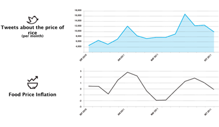

---

<!-- Slide 5 -->

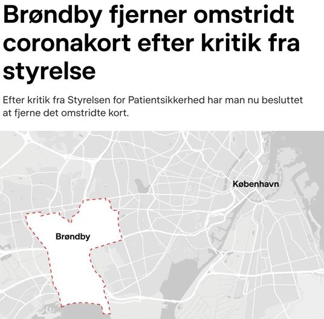

---

<!-- Slide 6 -->

Agenda for this lecture

●
Datafication: what is it and why does it matter?
●
The four ‘analytical moments’ from Flyverbom & Madsen
●
An example of datafication in ECHOLAB
●
A prompt for your case work

---

<!-- Slide 7 -->

Data is the “material produced by abstracting  the  
world  into  categories,  measures  and  other  
representational  forms  [...]  that constitute the building 
blocks from which information and knowledge are 
created” (Kitchin, 2014)

“Datafication” implies that  something is made into 
data” (Mejias & Couldry, p.2)

- it’s a verb!

.

---

<!-- Slide 8 -->

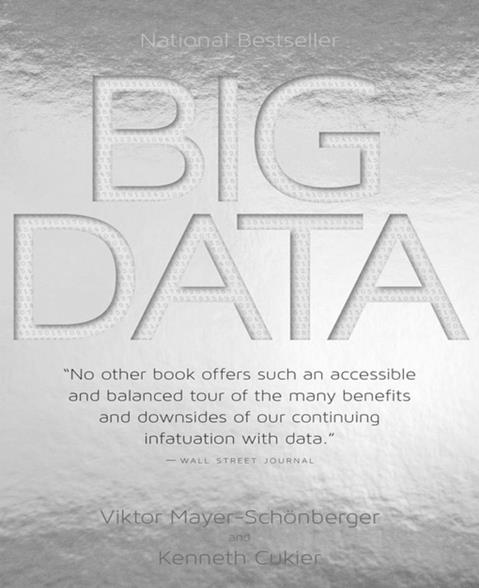

Datafication vs. 
Digitization
(From Cukier & Meyer-Schönberger, 2013)

“Data refers to a description of something 
that allows it to be recorded, analysed 
and reorganized”

“This is very different from digitization, the 
process of converting analog information 
into the zeros and ones of binary code”

---

<!-- Slide 9 -->

Datafication vs. 
Digitization
(From Cukier & Meyer-Schönberger, 2013)

“First, Google digitized text: every page was 
scanned and [...] transformed into a digital 
copy [...] that only humans could transform 
into useful information - by reading”.

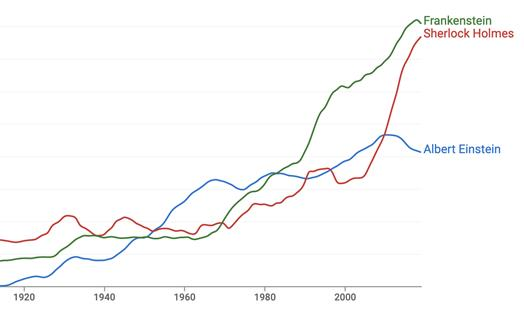

“Google wanted more. The company [...] 
used optical character recognition software 
that could take a digital image and 
recognize the letters, words, sentences, and 
paragraphs on it. The result was datafied 
text rather than a digitized picture of a 
page”.

---

<!-- Slide 10 -->

Datafication vs. 
Digitization
(From Cukier & Meyer-Schönberger, 2013)

●
Many organization lack a focus on 
datafication when they make 
strategic plans for digitization.

●
The data bi-effects of datafication 
are not thought through.

●
Copenhagen Municiplaity’s 
ticketing system as a good example

---

<!-- Slide 11 -->

“Digitalization turbocharges datafication. But it is not a substitute.” 
(Cukier & Schönberger, 2013)

---

<!-- Slide 12 -->

Datafication practices have long histories
(case: urban statistics)

“there went out a decree from Caesar Augustus, that all the world should be taxed”.

---

<!-- Slide 13 -->

Datafication practices have long histories
(case: urban statistics)

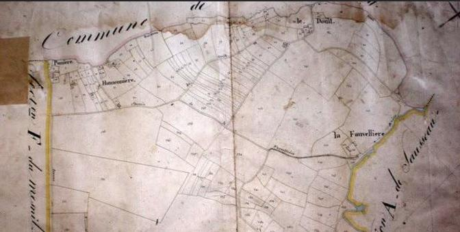

Napoleon’s cadastral maps

---

<!-- Slide 14 -->

Datafication practices have long histories
(case: urban statistics)

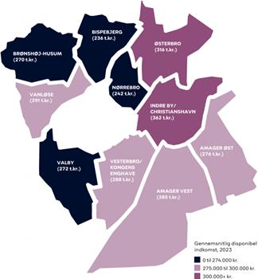

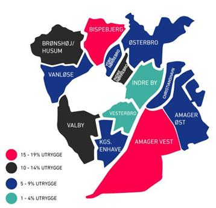

Foundation for taxation
….but also feelings of safety!!

---

<!-- Slide 15 -->

Turn to your neighbor for 3 minutes

Can you think of contemporary datafication practices still 
bear traces of pre-digital ways of measuring?

If yes, how and with what consequences?

---

<!-- Slide 16 -->

“Raw data” is both an oxymoron and a bad idea

◄Geoffrey Bowker, 
Professor of Information 
Science, UC Irvine.

Studies classification

systems and their 
consequences ►

Oxymoronic, because 
how does data 
become data?

Bad idea, because 
what if we pretended it 
was without 
consequences?

---

<!-- Slide 17 -->

Datafication battles are social battles

In  terms  of  actors,  we  have corporations, states, 
and various civic (activists, journalists, etc.) and even 
non-state (terrorists, hackers) actors, all of which can 
produce, collect and analyse data for different 
purposes.

(Mejias & Couldry, p.2)

---

<!-- Slide 18 -->

Datafication battles are social battles

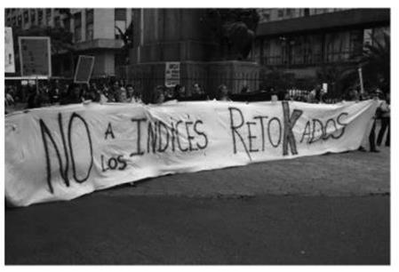

Steven Epstein (1995) The 
Construction of Lay Expertise: 
AIDS Activism and the Forging of

Lury & Gross (2014): THE DOWNS

AND UPS OF THE CONSUMER

PRICE INDEX IN ARGENTINA

Credibility in the Reform of

Clinical Trials

---

<!-- Slide 19 -->

…that sometimes exist inside an organization!
(case: research quality)

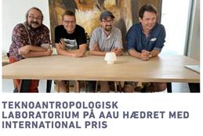

To management can

…while digital actors 
are also in the business

But people ‘on the floor’ (in

enforce specific 
metrics as incentives

this case researchers) will

of entering this

invent their own metrics

conversation

(e.g. prizes)

“The  production  of  data  cannot  be  separated  from  two  essential  elements:  the  
external infrastructure  via  which  it  is  collected,  processed  and  stored,  and 
processes  of value generation (Mejias & Couldry, p.2)”

---

<!-- Slide 20 -->

Turn to your neighbor for 3 minutes

Can you think of datafication battles in 
today’s society? Where people are in 
disagreement about how to turn the 
world into data and indexes?

If yes, which actors are active in 
proposing different strategies for 
producing, collecting and analysing 
data?

---

<!-- Slide 21 -->

How to think about datafication in a world 
where data is abundant?
Flyverbom & Madsen

---

<!-- Slide 22 -->

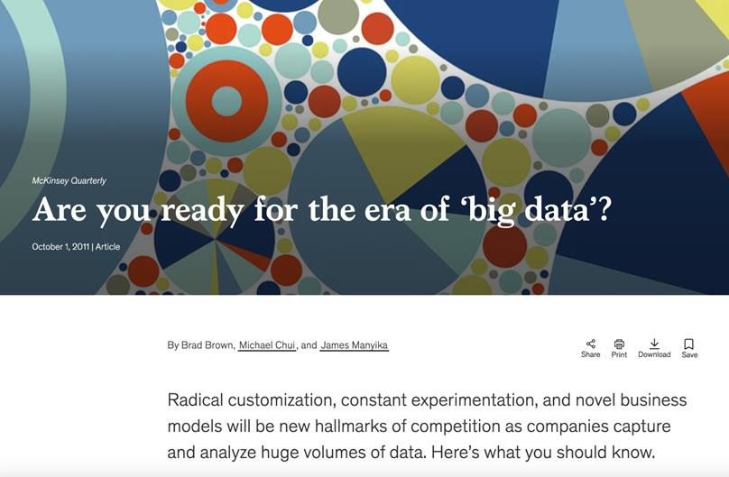

---

<!-- Slide 23 -->

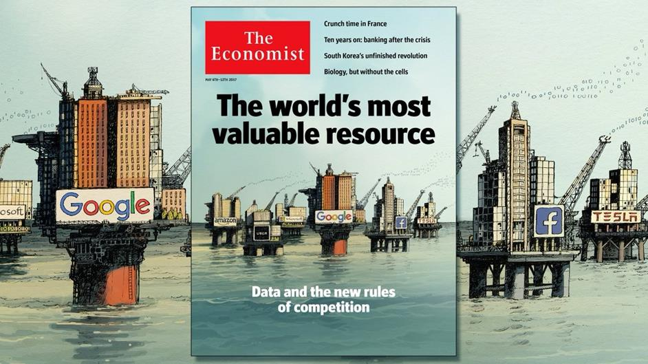

---

<!-- Slide 24 -->

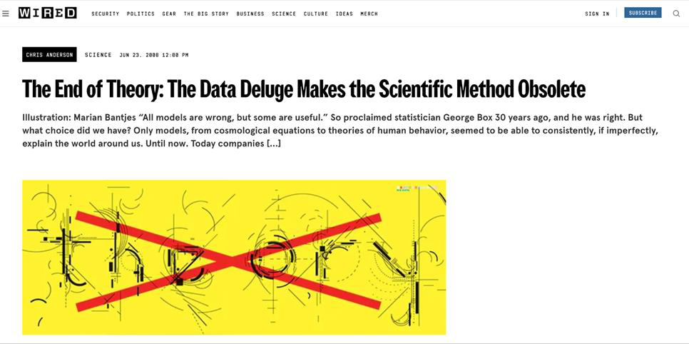

---

<!-- Slide 25 -->

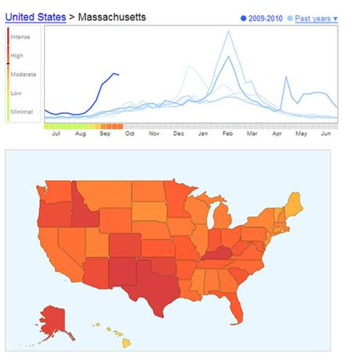

…but this hides how ‘big 
data’ always rests on 
consequential datafication 
choices

Lazer, D., Kennedy, R., King, G., & Vespignani, A. (2014). The parable of Google Flu: traps in big data analysis

---

<!-- Slide 26 -->

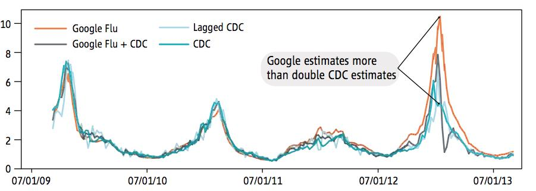

Lazer, D., Kennedy, R., King, G., & Vespignani, A. (2014). The parable of Google Flu: traps in big data analysis

---

<!-- Slide 27 -->

Four ‘analytical moments’ in datafication
I.e., situations where it makes sense to think about datafication consequences 
(Flyverbom & Madsen)

Production: Where human conduct and movements of objects are translated into a stream

of data that can be stored and processed by a computer

Structuring: Choices about the databases, classification systems and metadata through

which data is ordered and readied for systematic analysis.

Distribution: The way access to databases and distribution of digital traces are negotiated

between data-owners and end-users

Visualization: Turning the available data into visuali-ations that give insights into the aspect

of the world that one is interested in

---

<!-- Slide 28 -->

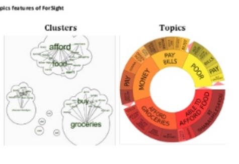

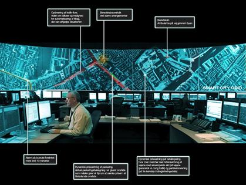

---

<!-- Slide 29 -->

Copenhagen Solutions Lab
UN Global Pulse

Technology
Context
Technology
Context

Production
Sensors, RFID tags, 
Wi-fi signals

Ongoing 
infrastructure 
projects

SoMe Platforms & 
API’s and data-
brokering

Re-design of 
interfaces and 
data end points

Municipal 
strategies

Structuring

Distribution

Visualization

---

<!-- Slide 30 -->

Turn to your neighbor for 3 minutes

Think about the two cases we are 
working with in this course - 
Rigshospitalet and Will & Agency.

Can you note down important 
questions regarding the production of 
data that we should keep in mind?

---

<!-- Slide 31 -->

Copenhagen Solutions Lab
UN Global Pulse

Technology
Context
Technology
Context

Production

Structuring
Municipal 
database w/ 
standardized 
metadata across 
subunits

Decision about 
metadata and 
internal power 
struggles.

Data categories 
driven by platform 
desire to produce 
clicks

User-driven 
metadata in 
constant 
development

Distribution

Visualization

---

<!-- Slide 32 -->

Turn to your neighbor for 3 minutes

Think about the two cases we are 
working with in this course - Rigshospitalet 
and Will & Agency.

Can you note down important questions 
regarding the structuring of data that we 
should keep in mind?

---

<!-- Slide 33 -->

Copenhagen Solutions Lab
UN Global Pulse

Technology
Context
Technology
Context

Production

Structuring

Distribution
Open database for 
municipal 
stakeholders

Interest-conflicts 
connected to 
procurement and 
branding

Communication 
from GP to the 
broader UN 
strategy team

Diverging views on 
criteria for 
legitimate data

Visualization

---

<!-- Slide 34 -->

Copenhagen Solutions Lab
UN Global Pulse

Technology
Context
Technology
Context

Production

Structuring

Distribution

Visualization
Real-time data on 
geo-mapping 
software

Continues a 
tradition dating 
back to cadastral 
maps

Real time indicators 
based on semantic 
patterns

Invention of 
baseline for 
anomaly detection

---

<!-- Slide 35 -->

Turn to your neighbor for 3 minutes

Think about the two cases we are 
working with in this course - 
Rigshospitalet and Will & Agency.

Can you note down important 
questions regarding the 
distribution/visualization of data that 
we should keep in mind?

---

<!-- Slide 36 -->

---

<!-- Slide 37 -->

Example
Grounding the technical discourse on AI

for public engagement at a museum

---

<!-- Slide 38 -->

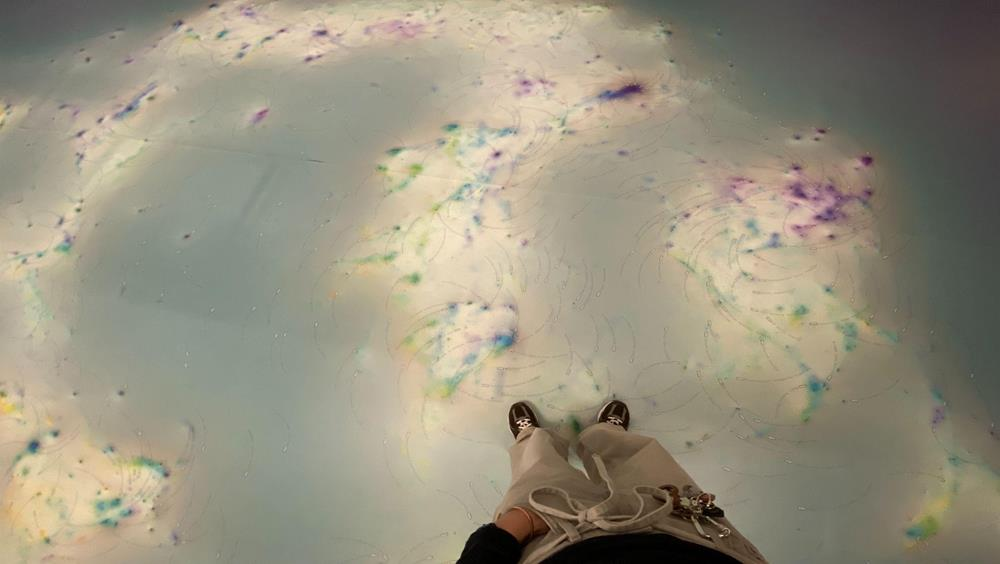

---

<!-- Slide 39 -->

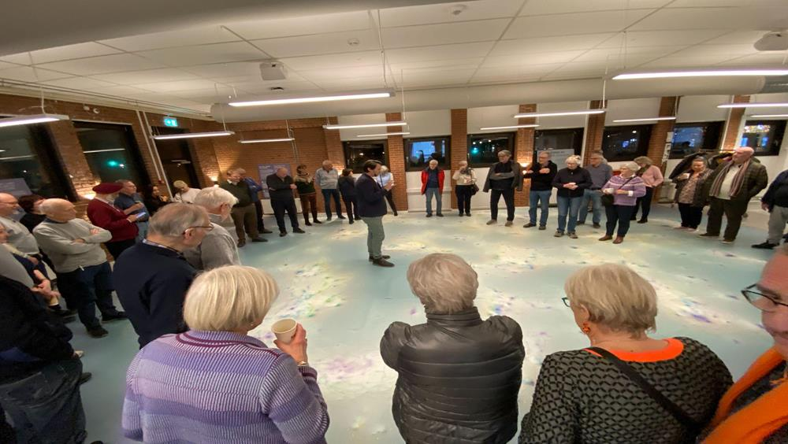

---

<!-- Slide 40 -->

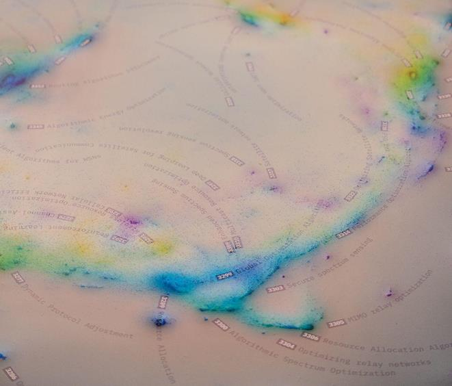

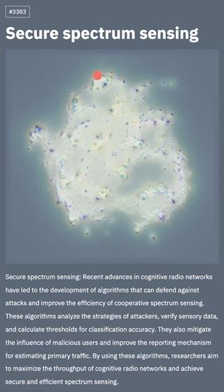

---

<!-- Slide 41 -->

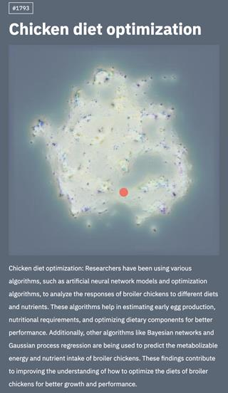

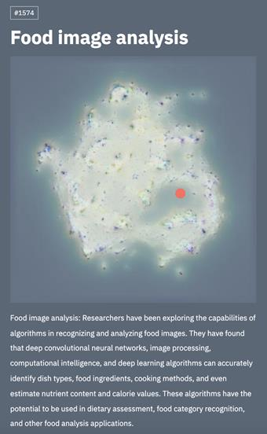

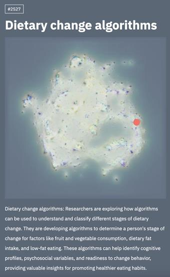

---

<!-- Slide 42 -->

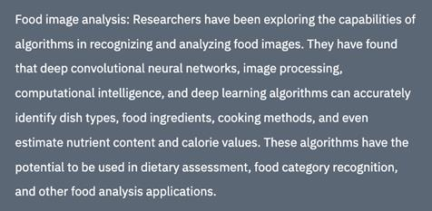

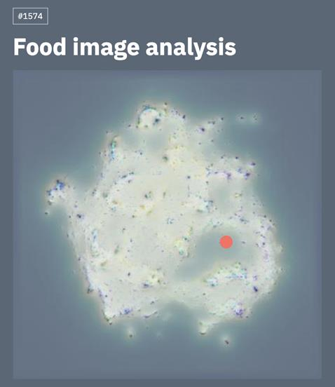

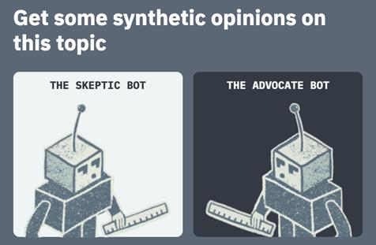

---

<!-- Slide 43 -->

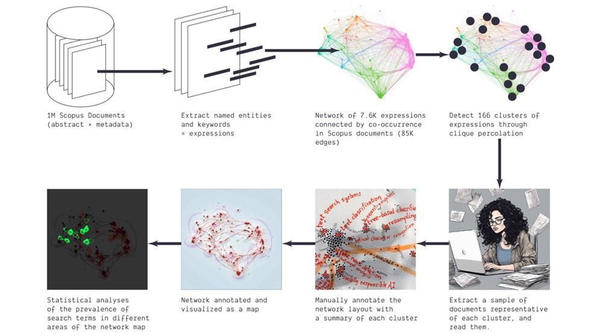

---

<!-- Slide 44 -->

Challenge
Spot the datafication issue at the level of

production

---

<!-- Slide 45 -->

Prompts for your case work and presentations

●
How was your data made and how is it now made available to you? 
Could it be otherwise?
●
Who made it and with what interests? Do these interests align with your 
interests? Could there be other interests in the company/organization?
●
What would need to change on the level of production, structuring, 
and/or distribution for you to best address the challenge you have 
been given by your case company? And how realistic are those 
changes?
●
What can be done within the frame of the available datafication? 
And with what reservations vis-a-vis the results?