<!-- Slide 1 -->

Analytics to Action
Exploratory Data 
Visualization

Anders Koed Madsen, March, 2026

---

<!-- Slide 2 -->

Theme 2: Making Data Valuable

How to make data and data analysis valuable to different stakeholders in practice.

Three sessions

1.
Datafication
2.
Exploratory data analysis
3.
Participatory data design

Readings for today

●
Venturini, T., Jacomy, M., & Jensen, P. (2021). What do we see when we look at networks: Visual network analysis, 
relational ambiguity, and force-directed layouts.
●
Sapienza, A., & Lehmann, S. (2021). A view from data science.

---

<!-- Slide 3 -->

Agenda for this lecture

●
Exploratory Data Analysis (EDA)
●
Why does visualization matter?
●
Visual network analysis (VNA) as a case of EDA
●
Exercise in class: VNA in practice 
●
Interview with Johan on EDA in Will & Agency
●
Prompt for your case presentations

---

<!-- Slide 4 -->

EDA at a glance

“The main purpose of EDA is to help look at data before making any 
assumptions. It can help identify obvious errors, as well as better 
understand patterns within the data, detect outliers or anomalous events, 
find interesting relations among the variables.”

— IBM Think Blog

“In essence, it involves thoroughly examining and characterizing your data 
in order to find its underlying characteristics, possible anomalies, and 
hidden patterns and relationships.”

— Towards Data Science

---

<!-- Slide 5 -->

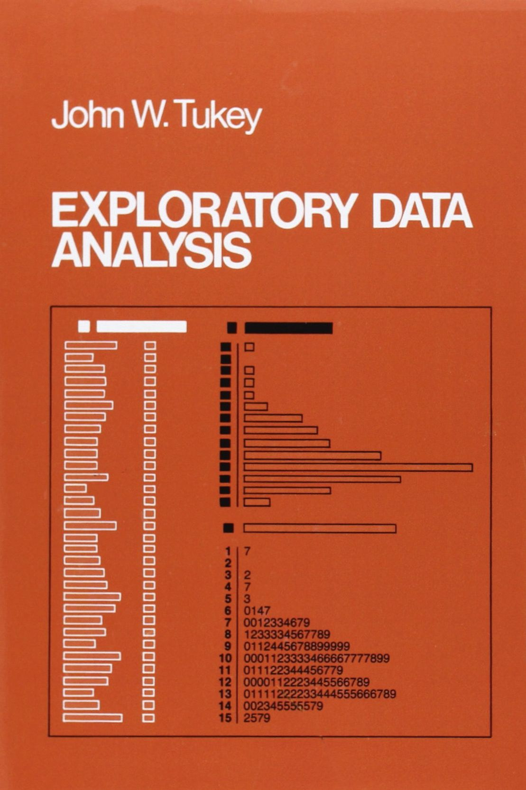

◄ Wrote the book on Exploratory Data Analysis in 1977

John Tukey, American statistician/mathematician, inventor of

the box plot, professor at Princeton▼

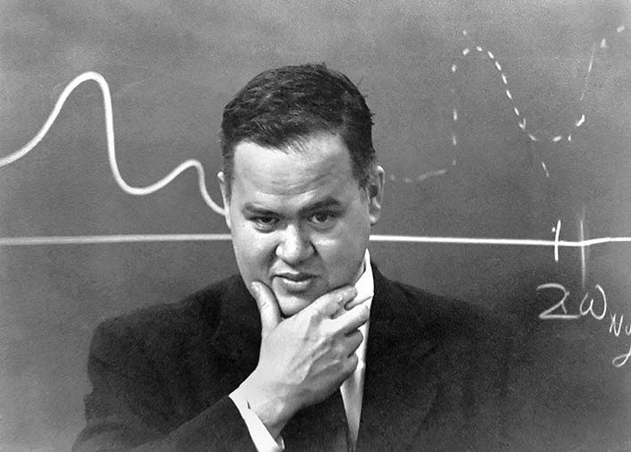

---

<!-- Slide 6 -->

“The greatest value of a picture is 
when it forces us to notice what we 
never expected to see.”

— Tukey, 1977

“Far better an approximate answer to 
the right question, which is often 
vague, than an exact answer to the 
wrong question, which can always be 
made precise.”

— Tukey, 1977

---

<!-- Slide 7 -->

Reaction to hypothesis-driven statistics

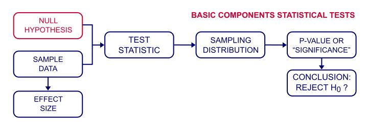

---

<!-- Slide 8 -->

A clear example of this 
experimental design is the prac- 
tice of preregistration, which is 
becoming predominant especially 
in psychology, economics, and 
political science.

When research is preregistered, 
not only the questions/ hypotheses 
need to be specified but also the 
variables and tests (Sapienza  and  
Lehmann, 2021)

---

<!-- Slide 9 -->

[data scientists] are not hypothesis-driven in the sense of many social 
scientists. As we explore the data, we form informal theories of what might 
be driving the patterns we see. We learn what the right questions (and 
variables) are (Sapienza  and  Lehmann, 2021)

---

<!-- Slide 10 -->

Hypothesis-driven

Rules

Rule-based ML
Answers (e.g. expert systems)

Data

Answers

Supervised ML
Rules/prediction (e.g. decision trees)

Data

Data
Unsupervised ML
Clusterings (e.g. K-means techniques)

Explorative

---

<!-- Slide 11 -->

---

<!-- Slide 12 -->

Question for discussion (5 minutes)

Think of your case. Can you think of both 
an explorative and hypothesis-based 
approach to analyzing the data you will 
be working with.

-
Please describe in a bit of detail what 
you would do with the data.

(e.g. a hypothesis driven approach to Rigshopitalet 
would be to start testing the hypothesis that people 
above 40 are more prone to show up than younger 
people)

---

<!-- Slide 13 -->

Why does visualization matter?

---

<!-- Slide 14 -->

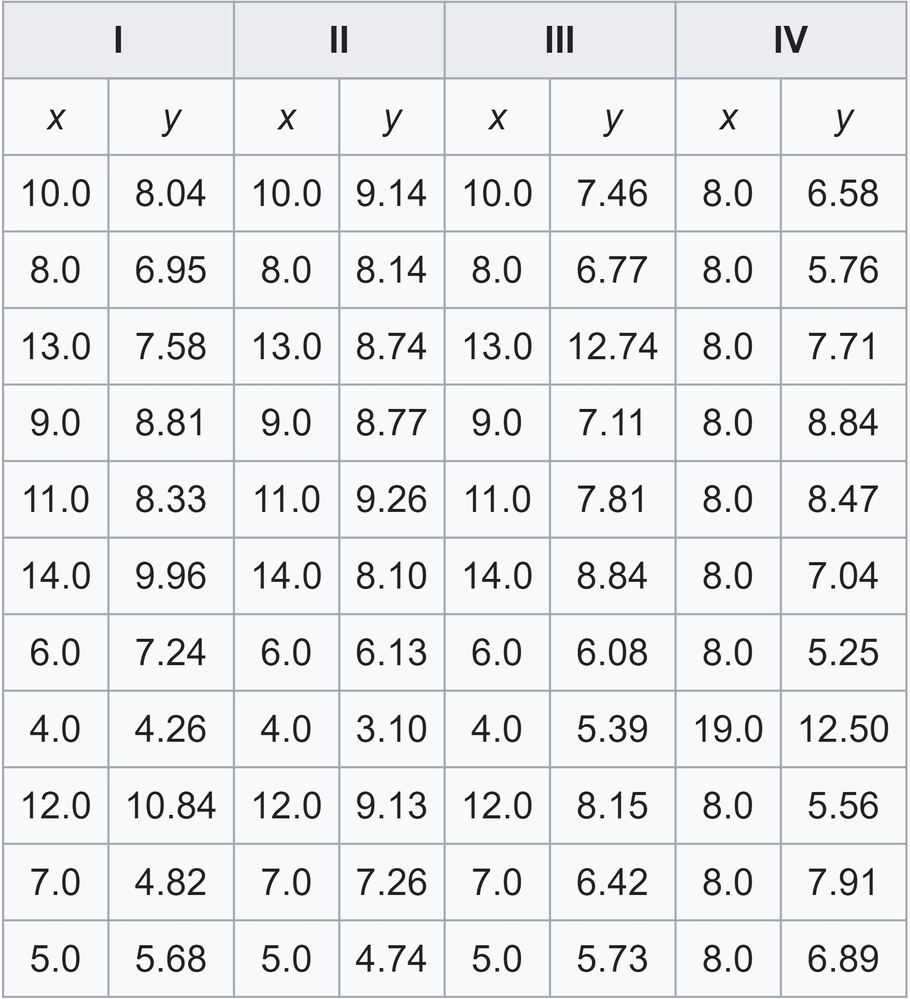

▲Francis Anscombe, British 
statistician, professor at Yale

◄ Anscombe’s quartet  (1973)

---

<!-- Slide 15 -->

When metrics fall short…

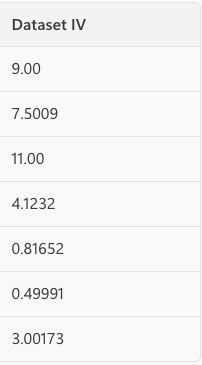

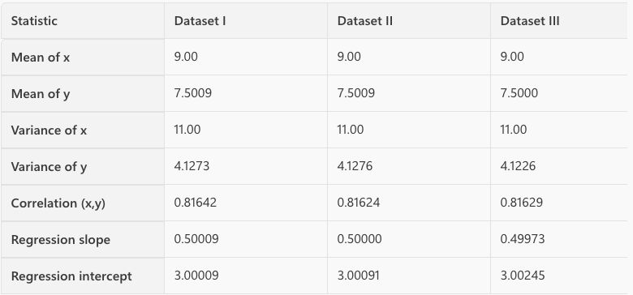

▲ Anscombe’s quartet

---

<!-- Slide 16 -->

…visualization can be the quickest way

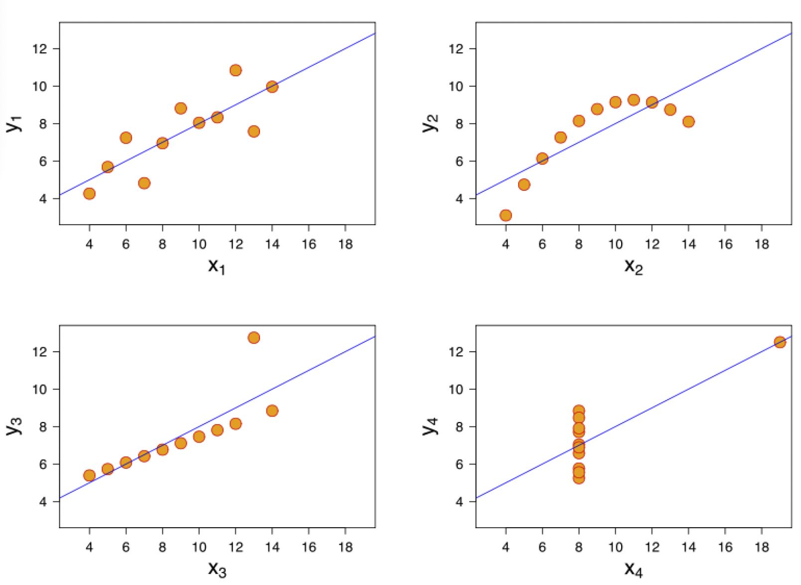

◄ Anscombe’s quartet

---

<!-- Slide 17 -->

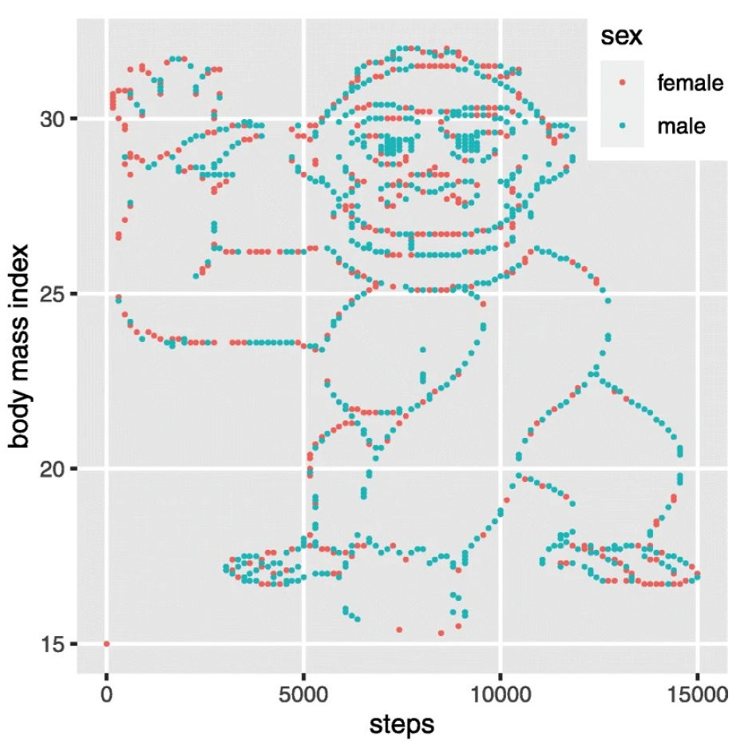

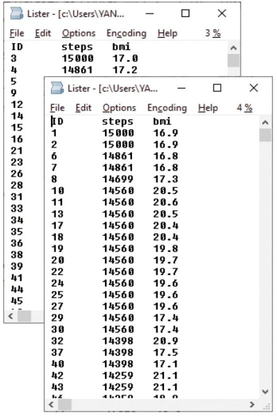

Artificial dataset given to 
students with and without

hypothesis on the 
relationship between BMI

and steps taken ▶

◄ Plot of the data

Contingency table for 
students with and without

hypothesis ▼

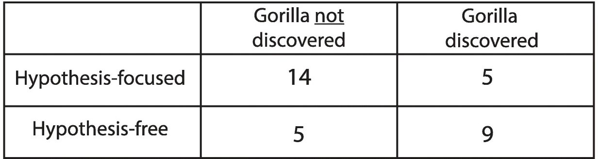

Yanai, I., Lercher, M. (2020) A hypothesis 
is a liability. Genome Biol 21, 231

---

<!-- Slide 18 -->

“The Invisible Gorilla”

When people focus on a specific task, they may become psychologically blind to unexpected features of the world

When people focus on testing a specific hypothesis, they may become psychologically blind to unexpected features of the data

---

<!-- Slide 19 -->

Not to be confused with explanatory visualization
Where you curate the visualization to convey a point

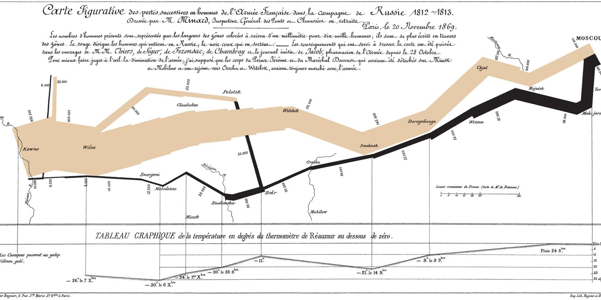

◄ Charles Minard’s map 
of Napoleon’s  1812 
campaign in Russia

---

<!-- Slide 20 -->

Question for discussion (5 minutes)

Please note down types of data 
visualizations and indicate in 
parentheses if you think of it as 
suitable for either explorative, 
hypothesis driven or both:

●
e.g. Bar charts (hypothesis 
driven because they require 
pre-defined categories)

---

<!-- Slide 21 -->

Visual Network Analysis
A paradigmatic case of EDA

---

<!-- Slide 22 -->

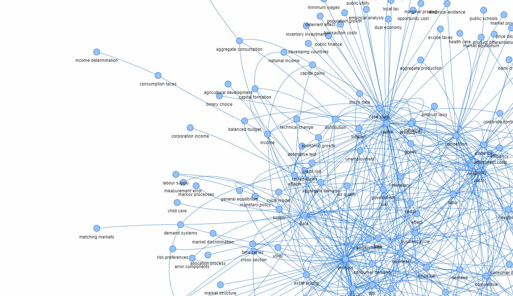

---

<!-- Slide 23 -->

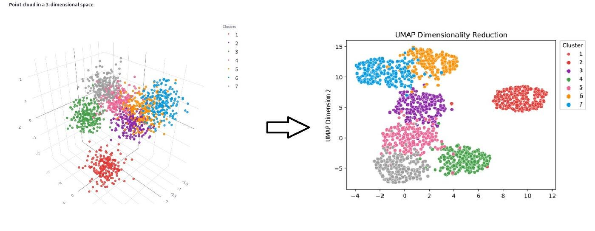

---

<!-- Slide 24 -->

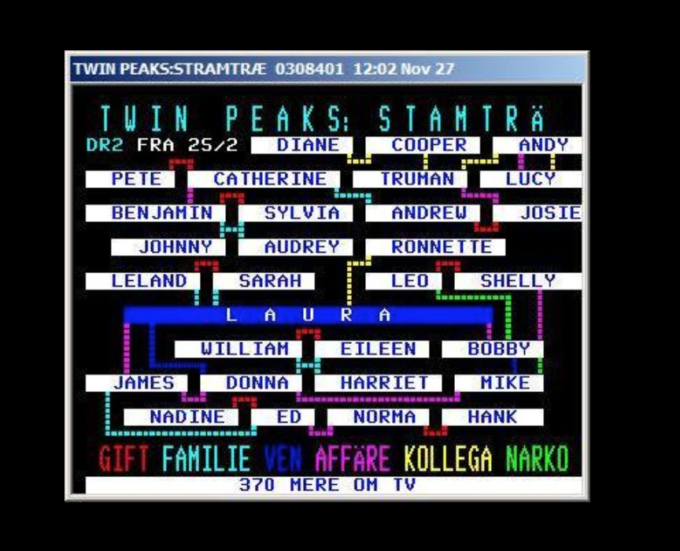

---

<!-- Slide 25 -->

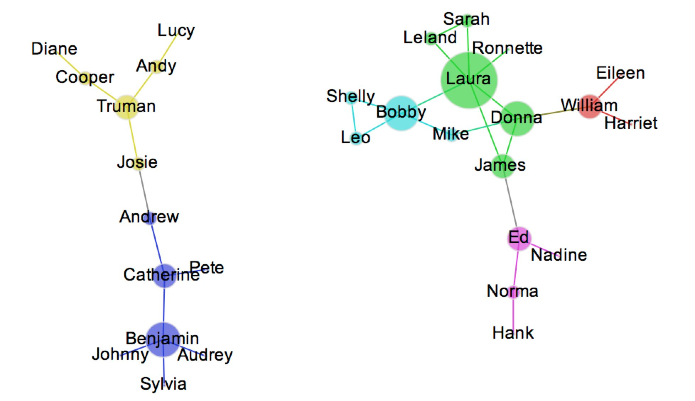

Layout: ForceAtlas2 (force directed)
Colour: Louvain Modularity
Size: Degree

---

<!-- Slide 26 -->

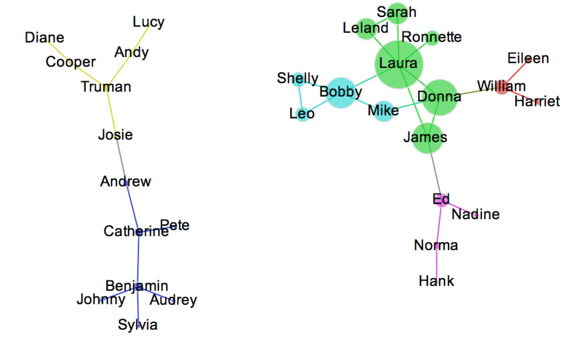

Layout: ForceAtlas2 (force directed)
Colour: Louvain Modularity
Size: Eigen Vector Centrality

---

<!-- Slide 27 -->

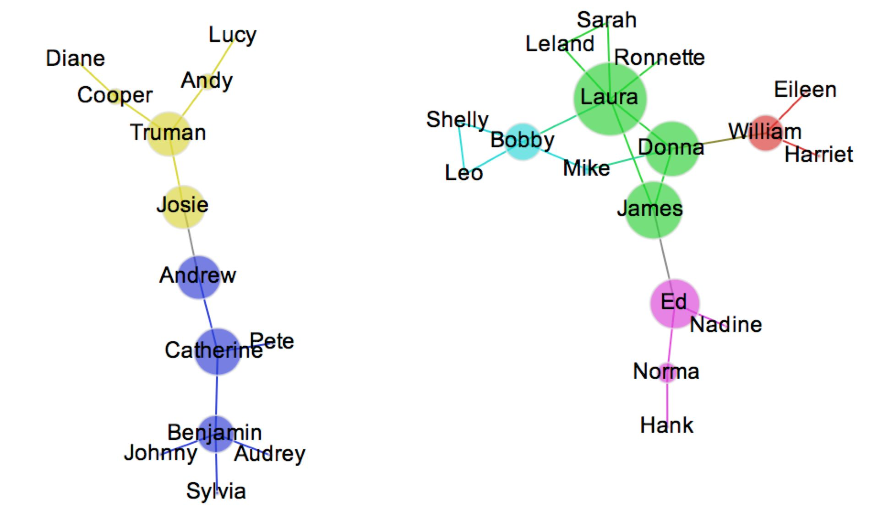

Layout: ForceAtlas2 (force directed)
Colour: Louvain Modularity
Size: Betweenness

---

<!-- Slide 28 -->

Forming hypotheses about music on Wikipedia 
through exploration of network topology

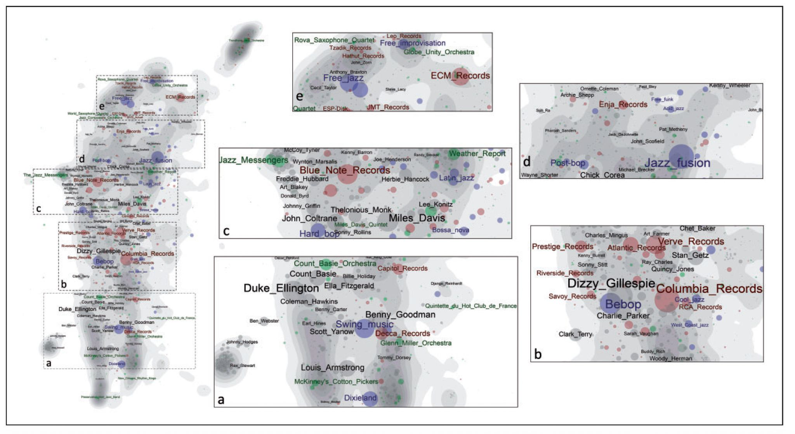

---

<!-- Slide 29 -->

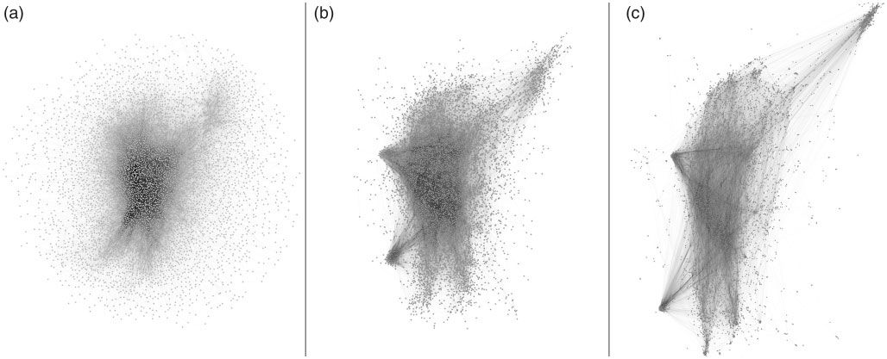

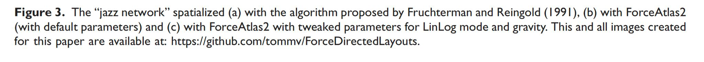

---

<!-- Slide 30 -->

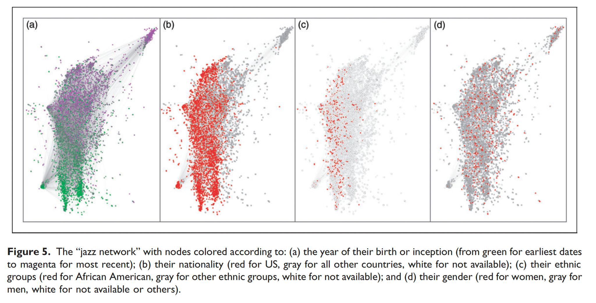

---

<!-- Slide 31 -->

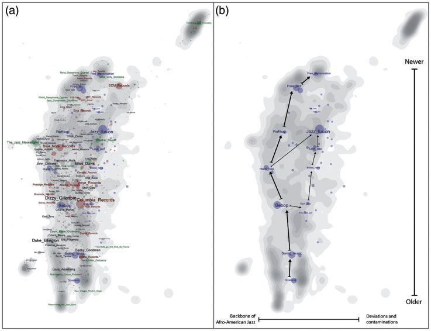

---

<!-- Slide 32 -->

Exercise
How are chefs talked about on 
food-related Facebook? Form some

hypotheses through VNA.

---

<!-- Slide 33 -->

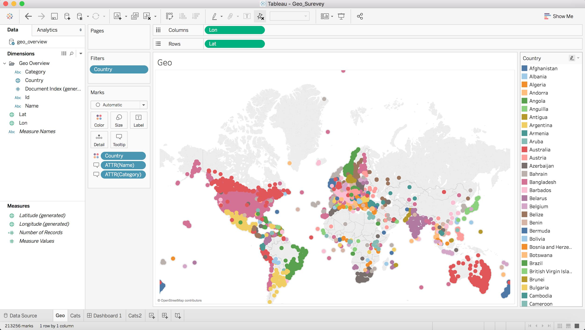

Food related FB page X

post

“René Redzepi opens

new Noma in 
Copenhagen”

post

“Learn to cook moose

head with Magnus 
Nilsson in Jämtland”

Dataset: All posts (text) from 242.000 food-related 
Facebook pages worldwide between 2010 and 2018

+ 670 names of famous chefs (scraped from Wikipedia)

NETWORK

René
Redzepi
Magnus

Nodes = chef names
Edges = co-mention on

Nilsson

food-related page

---

<!-- Slide 34 -->

Variables on nodes

●
Country names: To what extent has a chef been talked about by pages from this country.
●
Nordic: Is the chef from one of the nordic countries? If yes, which?
●
Mention count: How many times is the chef mentioned?
●
Page count: How many different pages are mentioning this chef?
●
Country count: How may different countries are the pages mentioning this chef from?
●
Degree: How many chefs other chefs is this chef mentioned together with?
●
You can also use the statistics module to compute the modularity class (using the Louvain method), i.e. cluster the chefs based on the 
topology of the network.

Variables on edges

●
Raw overlap: How many pages are co-mentioning two chefs?
●
Normalized overlap: How many pages are co-mentioning two chefs as a proportion of the max possible given as the number of pages 
mentioning each chef?
●
Only nordic overlaps: If only pages from the nordic countries are taken into account as co-mentioning chefs.

---

<!-- Slide 35 -->

Let’s try to enact an EDA process

on this data together….

---

<!-- Slide 36 -->

Engage in EDA yourself (7 minutes)

Download the .gexf file from Learn

Analyse it in Gephi Lite: https://gephi.org/gephi-lite/

---

<!-- Slide 37 -->

EDA at Will & Agency
Conversation with Johan

---

<!-- Slide 38 -->

Prompts for your case work and presentations

●
To what extent do you have clear hypotheses? To what extent are 
they testable?
●
What would be good exploratory visualizations to guide you towards 
more data-driven hypotheses?
●
Is your data relational? How could you explore it through visual network 
analysis? Concretely: what would be the nodes, what would be the 
edges?