<!-- Slide 1 -->

Analytics to Action
Participatory 
Data Design

Anders Koed Madsen, March, 2026

---

<!-- Slide 2 -->

Theme 2: Making Data Valuable

How to make data and data analysis valuable to different stakeholders in practice.

Three sessions

1.
Datafication
2.
Exploratory data analysis
3.
Participatory data design

Readings for today

●
Jensen, T. E., Birkbak, A., Madsen, A. K., & Munk, A. K. (2021). Participatory Data Design: Acting in a digital world. In 
Making & Doing: Activating STS through Knowledge Expression and Travel (pp. 117-136). MIT press.
●
Madsen, A. (2024). Digital methods as ‘experimental a priori’–how to navigate vague empirical situations as an 
operationalist pragmatist. Convergence, 30(1), 94-115.

---

<!-- Slide 3 -->

Agenda for this lecture

●
Definition: Participatory Data Design.
●
Involving stakeholders to align data projects and make them relevant
●
Gephi Lite as flexible visualization
●
Involving stakeholders to challenge their assumptions and generate hypotheses

BREAK

●
Niels from W&A Visits (10.30-10.50)

○
Students working with Rigshospitalet can leave and wait to join their call 
with Maja at 11.00.

---

<!-- Slide 4 -->

Participatory Data Design

Definition

---

<!-- Slide 5 -->

Participatory Data Design (PDD)

●
PDD refers to the involvement of stakeholders in data science projects. 
●
Involvement: active participation, typically upstream, influencing choices 
relating to dafication, analysis, and/or presentation.
●
Upstream because critical decisions that decide whether input and concerns 
can be taken into account are otherwise taken.
●
Active participation because challenges and opportunities will otherwise remain 
tacit and unacknowledged by the stakeholders.
●
Often happens through data sprints, i.e. workshops of varying length where pilot 
projects are co-developed and intermediary, exploratory visualizations are used 
to elicit running feedback from stakeholders.

---

<!-- Slide 6 -->

Involving stakeholders to make a data 
project relevant and align with their interests

(“Having data as a boundary object”)

---

<!-- Slide 7 -->

Professional Intuition

Data patterns

---

<!-- Slide 8 -->

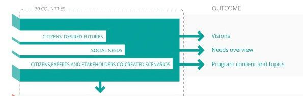

Prioritizing Zika virus stories from 
Twitter for public deliberation with 
the ASSET and CIMULACT projects

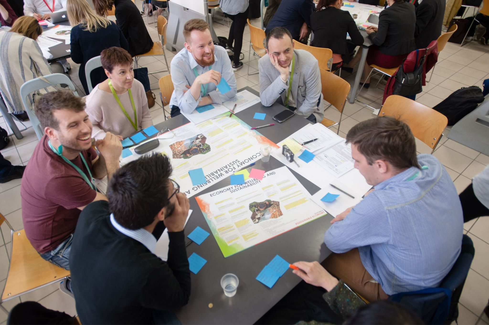

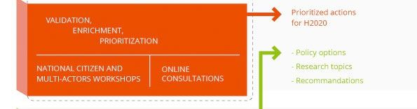

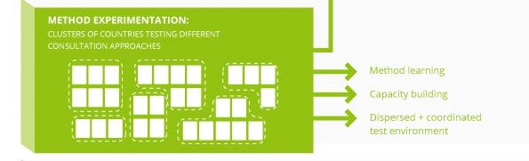

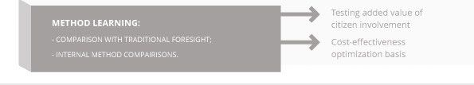

---

<!-- Slide 9 -->

---

<!-- Slide 10 -->

400,000 tweets containing 2,500 hashtags in a month

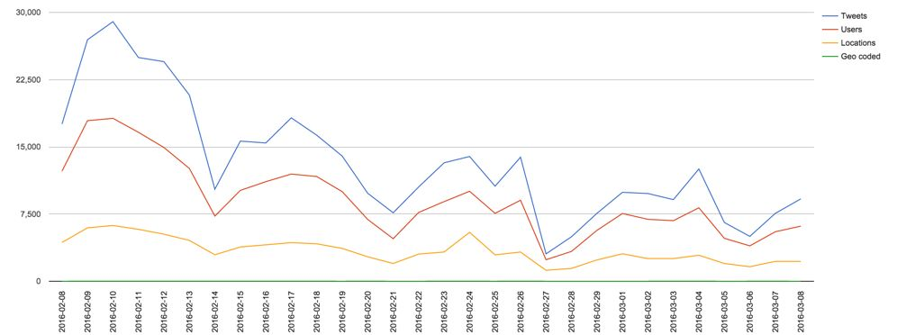

---

<!-- Slide 11 -->

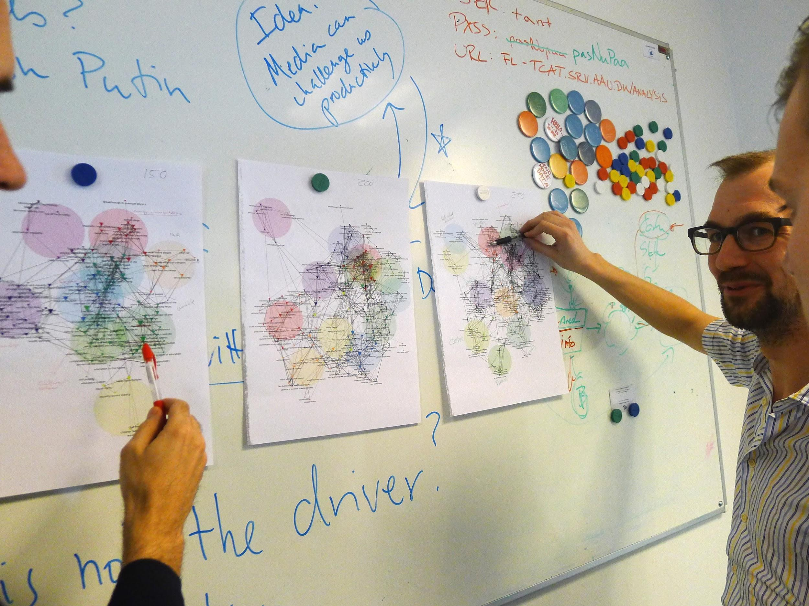

◄Identifying narratives through co-hashtag analysis

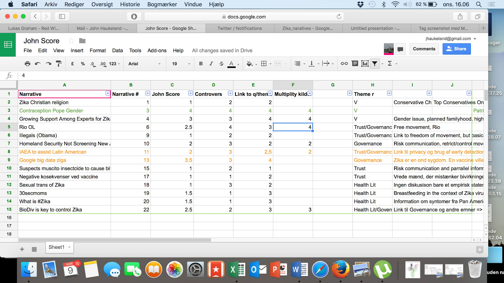

◄▲Developing the “John Score”

Jensen, T. E., Birkbak, A., Madsen, A. K., & Munk, A. K.

(2021). Participatory Data Design:

---

<!-- Slide 12 -->

What is important here?

●
Allowing stakeholders to 
participate in the definition of 
what is interesting.
●
Keeping decisions about 
datafication and analysis as 
open as possible.
●
Using intermediary visualizations 
as concrete occasions for 
stakeholders to provide 
feedback.

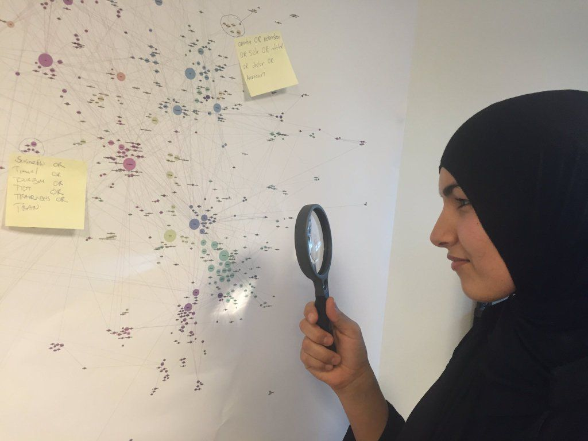

---

<!-- Slide 13 -->

5 minutes in groups: What could be a

minimum viable way to involve your 
case company at your presentation?

---

<!-- Slide 14 -->

Flexible (network) visualizations

“visualization  can  do  some  of  the  same  work  that  cheap  materials  such  as  
cardboard  boxes  and  Lego  brick  models  did  in  the  Scandinavian   tradition of 
participatory design”

“[...] occasionally the participants would start some kind of operation that would 
cause the networks  on the screen to slowly start moving as if the whole network was 
being pulled apart  while  some  parts  of  it  were  still  hanging  together.  Seconds  
later,  the  participants might stop the movement, study the new configuration 
carefully, and perhaps add  color, zoom in, or in some other way manipulate the 
display (Jensen et al, 2021)”

---

<!-- Slide 15 -->

DEMO
Working with flexible visualization to

understand the global market of

professional chefs

---

<!-- Slide 16 -->

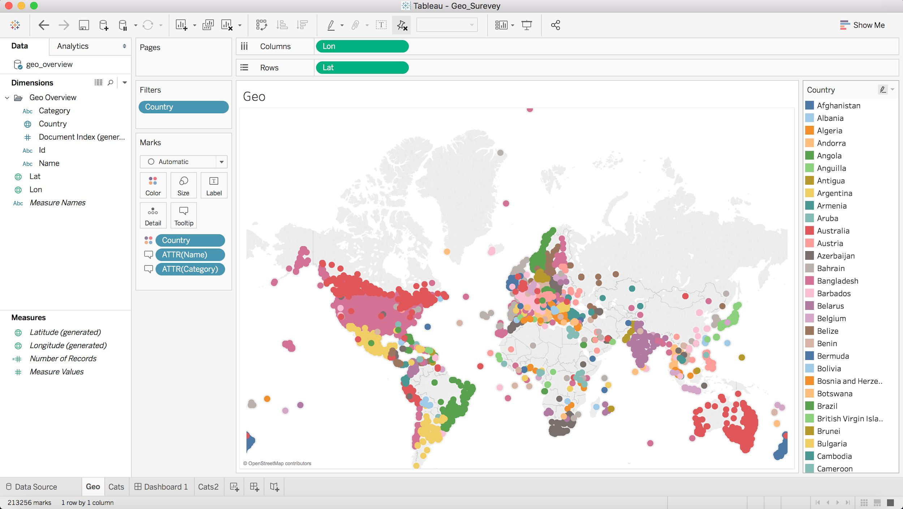

Food related FB page X

post

“René Redzepi opens

new Noma in 
Copenhagen”

post

“Learn to cook moose

head with Magnus 
Nilsson in Jämtland”

Dataset: All posts (text) from 242.000 food-related 
Facebook pages worldwide between 2010 and 2018

+ 670 names of famous chefs (scraped from Wikipedia)

NETWORK

René
Redzepi
Magnus

Nodes = chef names
Edges = co-mention on

Nilsson

food-related page

---

<!-- Slide 17 -->

Variables on nodes

●
Country names: To what extent has a chef been talked about by pages from this country.
●
Nordic: Is the chef from one of the nordic countries? If yes, which?
●
Mention count: How many times is the chef mentioned?
●
Page count: How many different pages are mentioning this chef?
●
Country count: How may different countries are the pages mentioning this chef from?
●
Degree: How many chefs other chefs is this chef mentioned together with?
●
You can also use the statistics module to compute the modularity class (using the Louvain method), i.e. cluster the 
chefs based on the topology of the network.

Variables on edges

●
Raw overlap: How many pages are co-mentioning two chefs?
●
Normalized overlap: How many pages are co-mentioning two chefs as a proportion of the max possible given as 
the number of pages mentioning each chef?
●
Only nordic overlaps: If only pages from the nordic countries are taken into account as co-mentioning chefs.

---

<!-- Slide 18 -->

Let’s look at the network as an example

of a flexible visualization to be used in

PDD processes.

---

<!-- Slide 19 -->

Work after class

Download the .gexf file from Learn (called “chef_overlap_full)

Analyse it in Gephi Lite: https://gephi.org/gephi-lite/

Try to engage with the data:

-
to find patterns that seem interesting in order to understand the global market of chefs
-
to list who you would ideally invite in to help you explore this data. What type of 
‘domain expertise’ would you need to ensure a good interpretative process?

---

<!-- Slide 20 -->

Involving stakeholders to challenge their

preference for agreement and explore

new hypotheses

(Case: GEHL)

---

<!-- Slide 21 -->

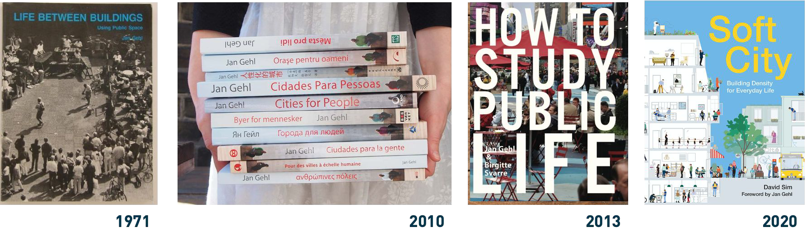

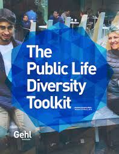

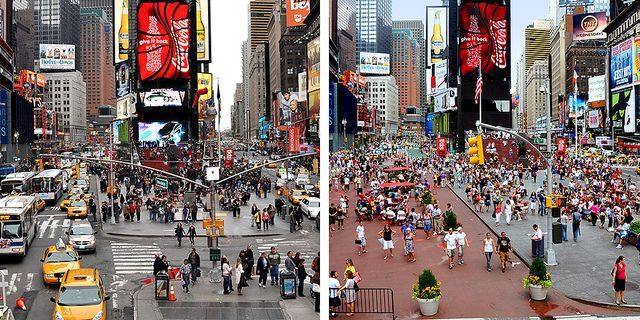

“We measure what we care about”

---

<!-- Slide 22 -->

The problem: urban political diversity

---

<!-- Slide 23 -->

‘The Gehl Lens’ (The public life diversity toolkit)

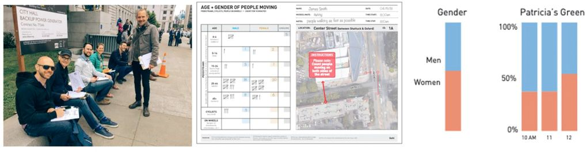

---

<!-- Slide 24 -->

“The Facebook lens”

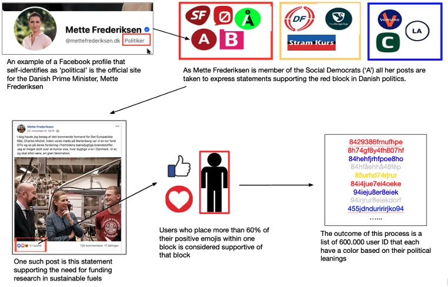

---

<!-- Slide 25 -->

“The Facebook lens”

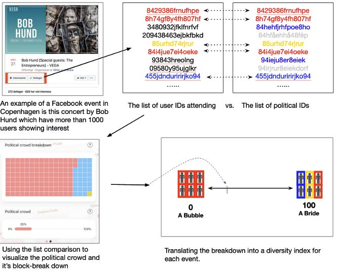

---

<!-- Slide 26 -->

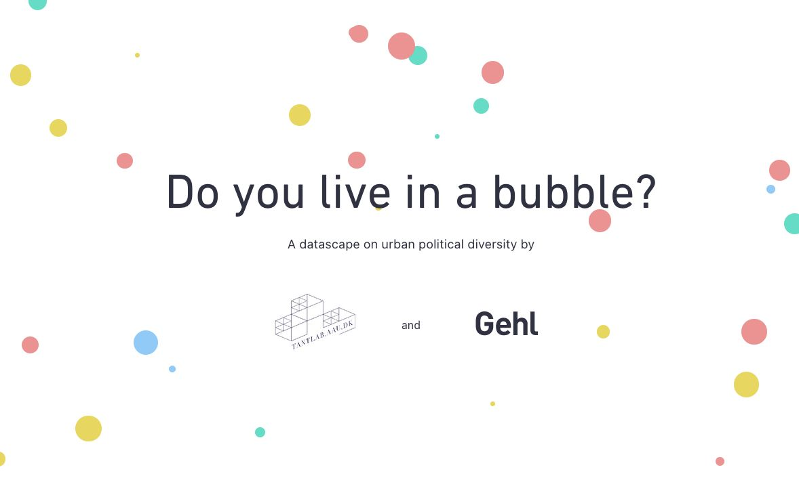

---

<!-- Slide 27 -->

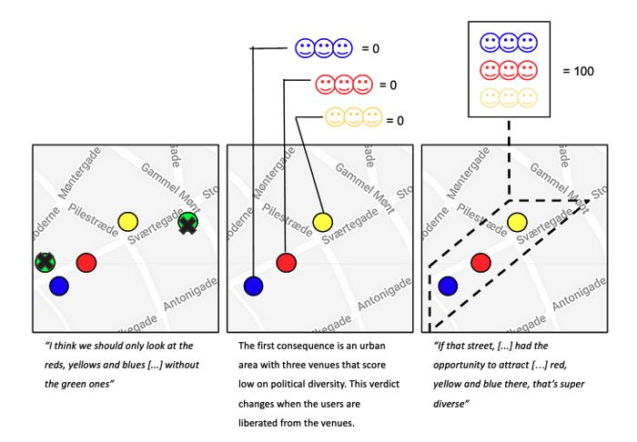

---

<!-- Slide 28 -->

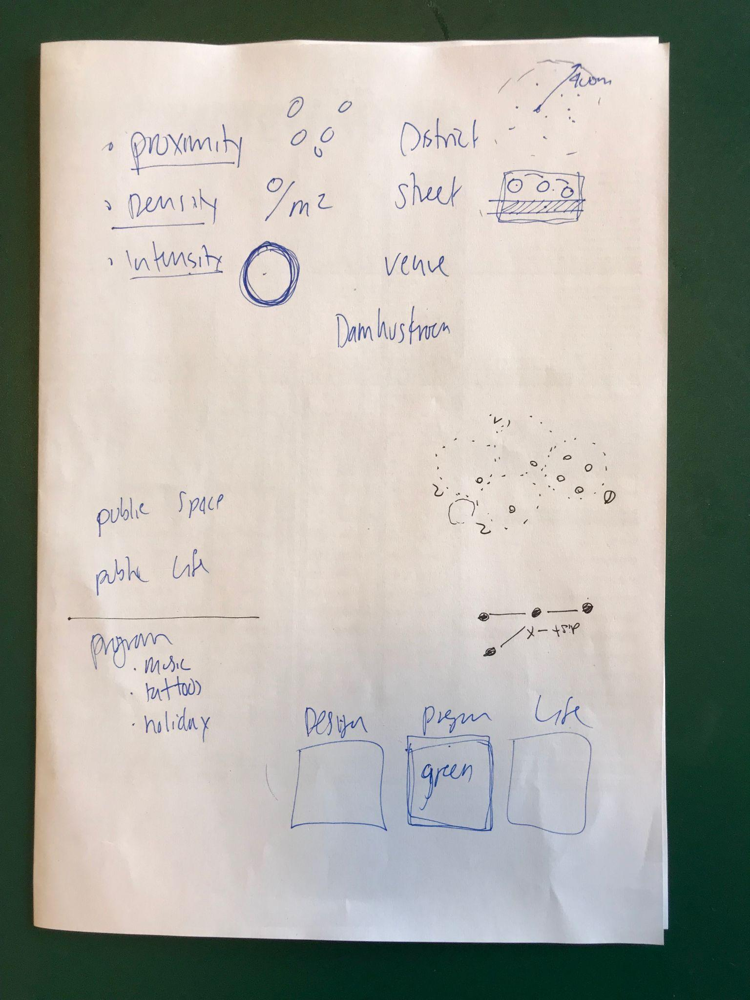

---

<!-- Slide 29 -->

Outside 
Gehl’s 
control

Vs

Within 
Gehl’s 
control

---

<!-- Slide 30 -->

Prompts for your case work and presentations

●
How do you ensure that your data project is aligned with the interests 
of your case companies, given that these interests will likely become 
much clearer, more precise, explicit and even possible redefined when 
they see your presentation?
●
How will you ensure that the new questions and hypotheses that can 
be discovered by exploring your data are also vetted and prioritized 
by your case companies? 
●
How will you ensure that your case companies do not impose the 
interpretations that align with their preconceived ideas on your results?