<!-- Slide 1 -->

Theme 3 – Challenges in the Data Economy – Ethical 
perspectives on data-driven management

From analytics to 
action

From Analytics to Action
1
March 16, 2026

Technical University of Denmark

---

<!-- Slide 2 -->

Follow-up question Rigshospitalet

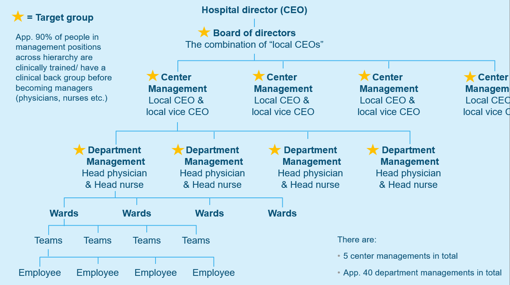

Technical University of Denmark

From Analytics to Action
2

---

<!-- Slide 3 -->

Today

• Learning objective #1
• Analyze ethical challenges and 
opportunities in a specific data analysis 
project.

1.Concepts:

o Data ethics (of power)
o Data interest analysis
o Ethics as data innovation
o 4 models of data governance

• How do you analyze ethical challenges? 
Can they be an opportunity at the same 
time?

1. data sharing pools
2. data cooperatives
3. public data trusts
4. personal data sovereignty

• Start with thinking about power 
relations: Who has the power to raise 
issues, define problems, or propose and 
create the solutions in relation to data-
driven management? How could you 
conduct a data interest analysis for an 
organization (but also beyond)?

Technical University of Denmark

From Analytics to Action
3

---

<!-- Slide 4 -->

Teaching you two things at a time

• How to analyze challenges in the 
data economy using the concept of 
data ethics

• Understanding the use of social 
science concepts in relation to an 
organizational problem

Technical University of Denmark

From Analytics to Action
4

---

<!-- Slide 5 -->

Data ethics: the new competitive advantage (Hasselbalch and 
Tranberg, 2016: 9)

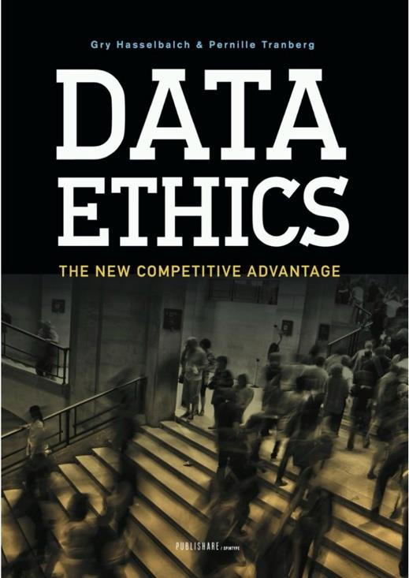

"We are living in an era defined and shaped 
by data. Data makes the world go round. It 
is politics, it is culture, it is everyday life and 
it is business. Our data-flooded era is one of 
technological progress, with tides rising at a 
never seen before pace. Roles, rights and 
responsibilities are reorganised and new 
ethical questions posed. Data ethics must 
and will be a new compass to guide us."

Technical University of Denmark

From Analytics to Action
5

---

<!-- Slide 6 -->

Data ethics failure 1: Facebook – Cambridge 
Analytica data scandal (2014)

• The issue:
o Data from about 87 million Facebook

users was collected through a personality 
quiz app
o Most users did not consent to their data

being used

• How the data was used
o To create psychological profiles of voters
o Used for targeted political advertising

• Ethical issues
o Lack of informed consent
o Secondary use of personal data
o Potential manipulation of democratic

processes

Technical University of Denmark

From Analytics to Action
6

---

<!-- Slide 7 -->

Data ethics failure 2: Dieselgate - Volkwagen (2015)

• The issue:
o Volkswagen installed software in diesel cars that

detected emissions testing conditions

• How the data was used:
o The car’s system used sensor data to recognize

test environments
o It changed engine behaviour to pass tests.

During normal driving, emissions were far higher 
than reported

• Ethical issues:
o Intentional algorithmic deception
o False environmental data
o Harm to public health and trust

Technical University of Denmark

From Analytics to Action
7

---

<!-- Slide 8 -->

Data ethics failure 3: UBER's 'God view' controversy 
(2014)

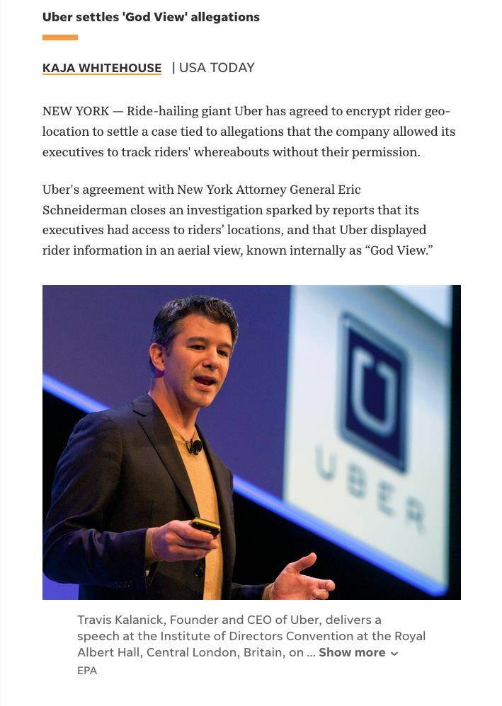

• This issue:
o Uber employees had access to a tool called “God View”
o It allowed them to see real-time locations of riders and

drivers

• Ethical problems
o Employees reportedly tracked journalists and customers
o Users were not aware this level of monitoring existed

• Ethical issues
o Privacy violations
o Abuse of internal data access
o Lack of data governance

Technical University of Denmark

From Analytics to Action
8

---

<!-- Slide 9 -->

What categories of unethical data use do these 3 
cases represent?

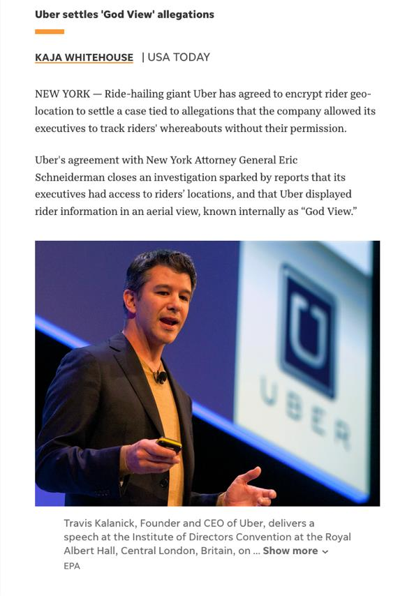

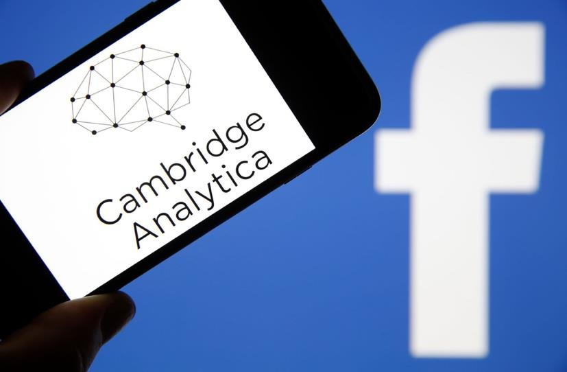

Technical University of Denmark

From Analytics to Action
9

---

<!-- Slide 10 -->

What is an ethical company in the Big Data era? (Hasselbalch and 
Tranberg, 2016: 10-11)

• Go beyond legal compliance with data protection laws
• Follow the spirit of legislation, not just the rules
• Actively listen to customers about how their data is used
• Maintain clear and credible transparency in data management
• Collect and process only necessary data (data minimisation)
• Build a privacy-aware corporate culture and organisational structure
• Develop products using Privacy by Design
• Use ethical reflection in decisions, asking:
– Would I accept this as a consumer?
– Is this the kind of data environment I want for my children?

Technical University of Denmark

From Analytics to Action
10

---

<!-- Slide 11 -->

What is "Data Ethics of Power" (Hasselbalch, 2021)

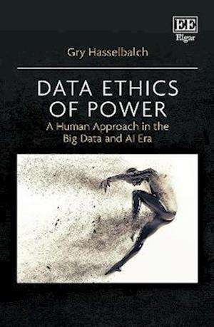

“Data ethics (of power) addresses the distribution of power 
and power relations in the Big Data Society and the 
conditions of their negotiation and distribution. Applied data 
ethics is concerned with making these power relations 
visible in order to point to design, business, policy, social 
and cultural processes that support a human(-centric) 
distribution of power.” 
(Hasselbalch, 2021: 10)

• Power dynamics and interests by design
• Whose interests are prioritized?
• Who is empowered? Who is disempowered?

Technical University of Denmark

From Analytics to Action
11

---

<!-- Slide 12 -->

Exercise about data ethics of power – smart city 
planning

Discuss in small groups the ethical 
challenges in smart city projects (e.g., 
surveillance, lack of citizen participation, etc.) 
and propose two ethical rules that cities 
should consider

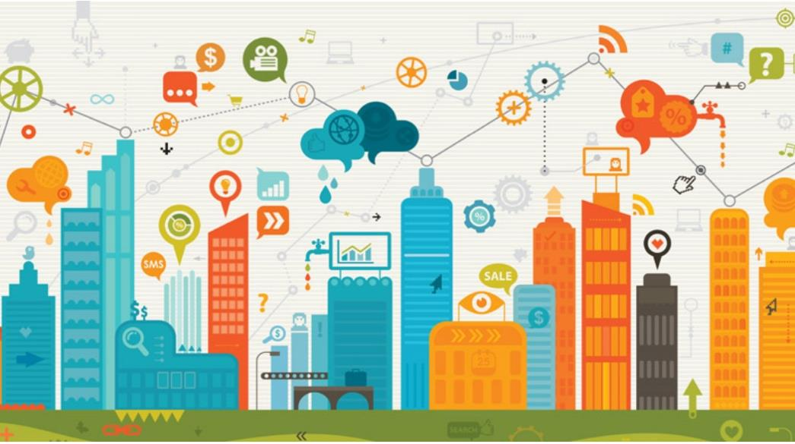

• Topics to discuss:
o What data should the city collect?
o Who should own and control the data?
o How should citizens be involved in

decisions about data?
o What rules should exist about how data is

used, to prevent misuse, to ensure public 
oversight?

Technical University of Denmark

From Analytics to Action
12

---

<!-- Slide 13 -->

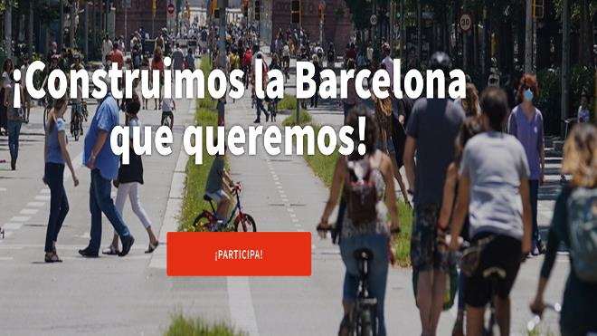

Technical University of Denmark

From Analytics to Action

---

<!-- Slide 14 -->

How to conduct a data interest analysis

•
Multi-level analysis: examples on 
micro, meso, macro

• How different interests in data are 
empowered or disempowered by 
design

Technical University of Denmark

From Analytics to Action
14

---

<!-- Slide 15 -->

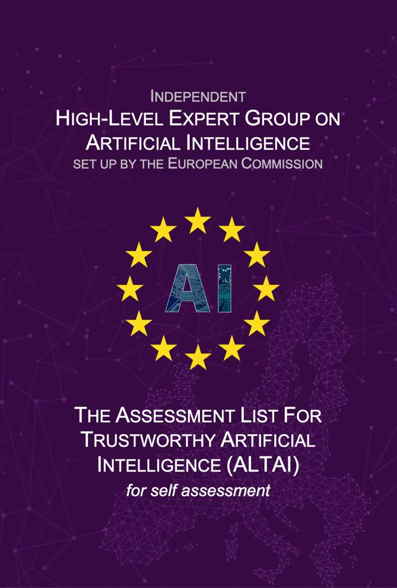

human agency and oversight

e.g. Is the AI system designed to interact, guide or take decisions by human end-users that 
affect humans or society?

technical robustness and safety

e.g. Could the AI system have adversarial, critical or damaging effects (e.g. to human or 
societal safety) in case of risks or threats such as design or technical faults, defects, outages, 
attacks, misuse, inappropriate or malicious use?

privacy and data governance

e.g. Did you consider the impact of the AI system on the right to privacy, the right to physical, 
mental and/or moral integrity and the right to data protection?

transparency

e.g. Did you put in place measures that address the traceability of the AI system during its 
entire lifecycle?

diversity, non-discrimination and fairness

e.g. Did you assess whether the AI system's user interface is usable by those with special needs 
or disabilities or those at risk of exclusion?

Any one of these ethical 
requirements could be a 
design choice (and a form of 
innovation)

environmental and societal well-being 
e.g. Are there potential negative impacts of the AI system on the environment?

accountability

– examples?

e.g. Did you foresee any kind of external guidance or third-party auditing processes to 
oversee ethical concerns and accountability measures?

Technical University of Denmark

---

<!-- Slide 16 -->

Ethics as data innovation

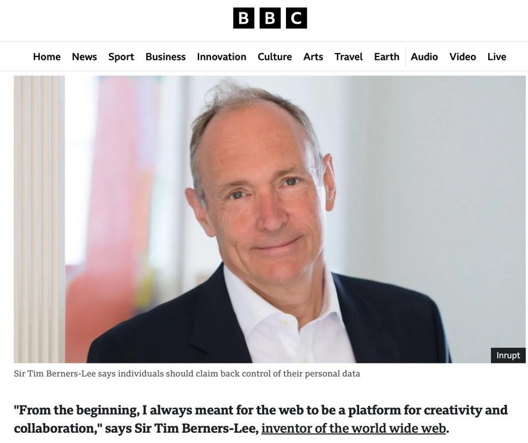

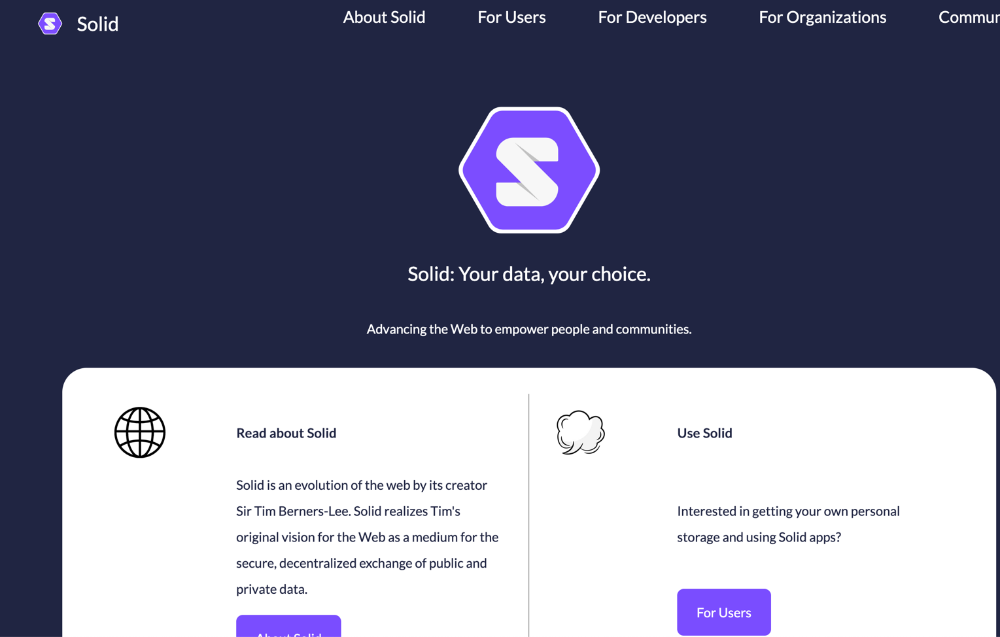

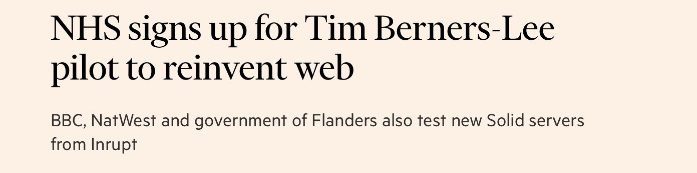

Technical University of Denmark

---

<!-- Slide 17 -->

Solid is a framework that enables individuals to store their personal data in “pods” (Personal Online 
Data Stores), giving them control over who accesses their information.

It represents a shift from centralized data exploitation to a user-centric, ethically designed data 
service.

1.User Data Ownership – Instead of companies storing user data on their servers, users keep their 
data in self-controlled pods.
2.Consent-Driven Access – Users explicitly decide which applications or companies can access 
specific data.
3.Decentralized Storage – Reduces risks of mass surveillance, data breaches, and exploitation by 
central authorities.
4.Interoperability & Transparency – Solid is open-source and built on semantic web standards

• Flanders, Belgium: The Flemish Government is integrating Solid for citizen-controlled digital 
identity and data sharing across government services.

Technical University of Denmark

---

<!-- Slide 18 -->

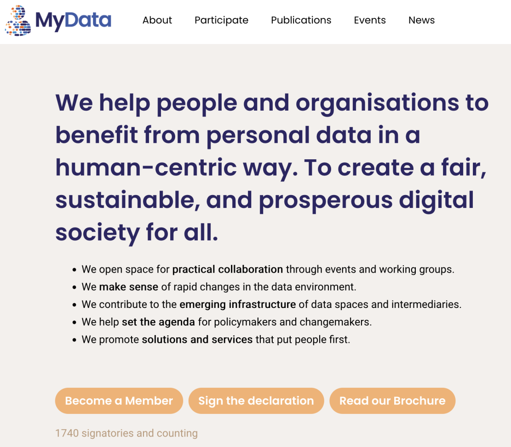

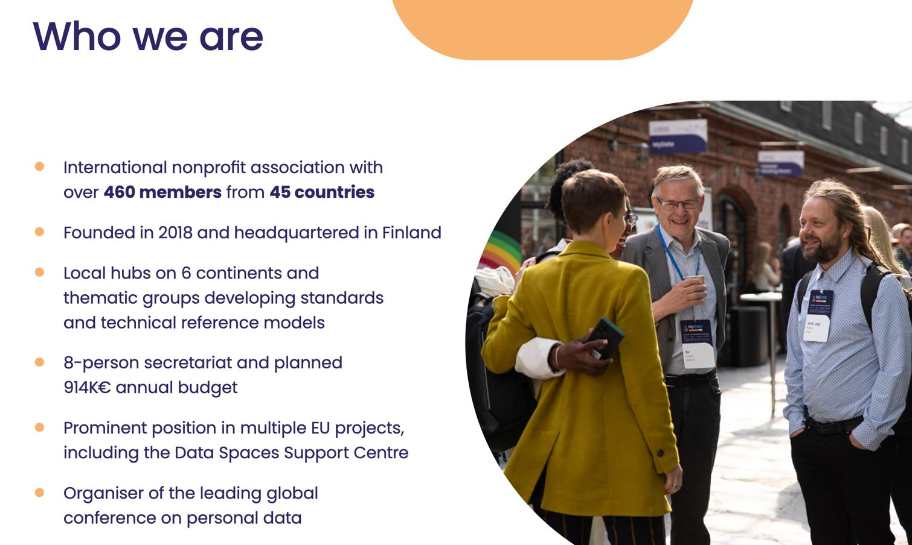

Technical University of Denmark

---

<!-- Slide 19 -->

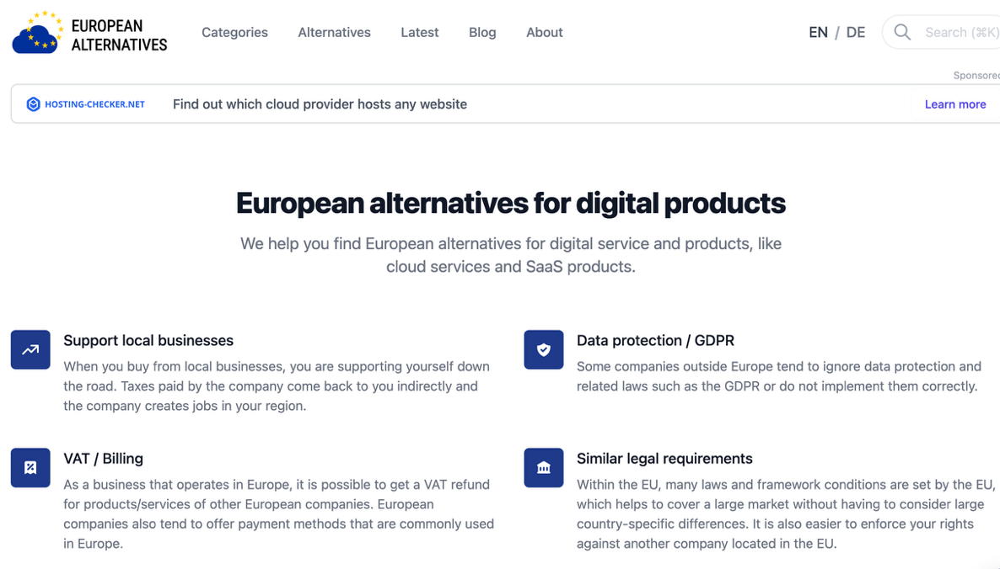

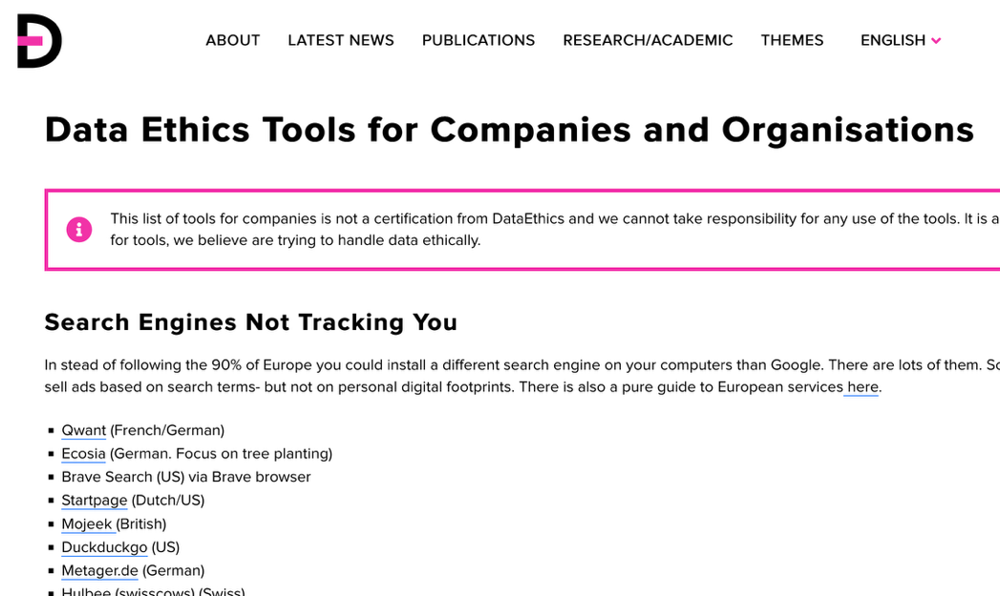

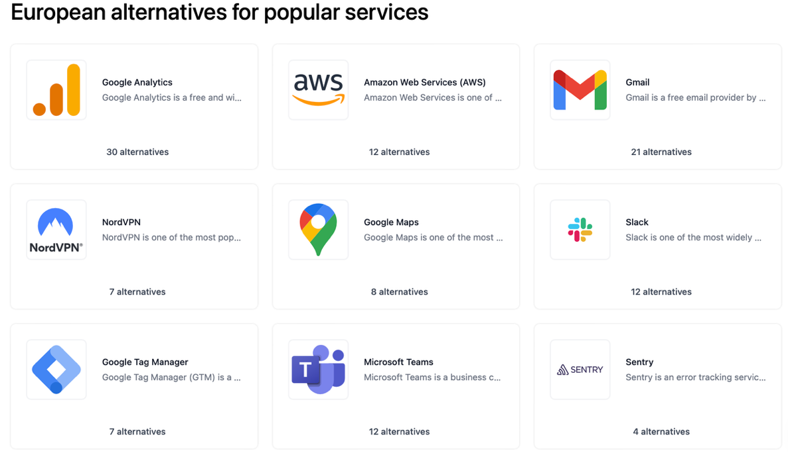

https://dataethics.eu/

https://european-alternatives.eu/

Technical University of Denmark

---

<!-- Slide 20 -->

4 models of data governance (Micheli et al., 2020: 6)

Model
Who controls the 
data?

Main goal
Example

Innovation and 
economic value through 
combining data from 
different sources

Multiple organizations 
share and combine 
datasets

Companies sharing 
mobility data for traffic 
services

Data Sharing Pools 
(DSP)

Citizens collectively 
manage and decide 
how their data is used

Empower citizens and 
create public or social 
value

Health data 
cooperatives like 
MIDATA

Data Cooperatives 
(DC)

Public institutions 
manage data on behalf 
of citizens

Use data responsibly 
for policy making and 
public good

City governments 
managing urban data 
for planning

Public Data Trusts 
(PDT)

Individuals control 
access to their own 
data

Personal Data 
Sovereignty (PDS)

Data self-determination 
and user control

MyData movement 
personal data spaces

Technical University of Denmark

20

---

<!-- Slide 21 -->

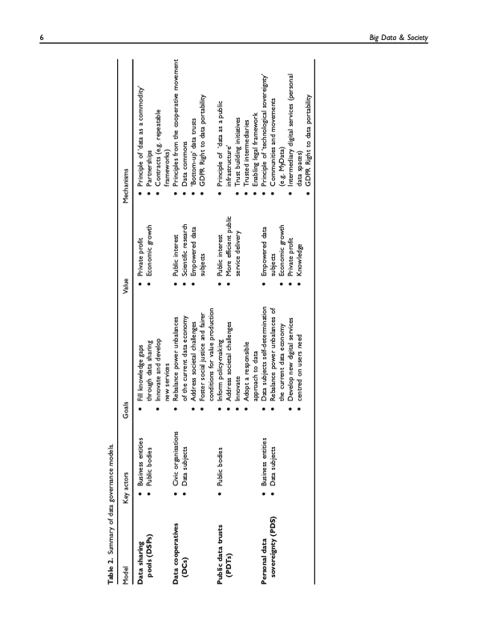

4 models of data governance (Micheli et al., 2020: 6)

Technical University of Denmark

21

---

<!-- Slide 22 -->

Example for data sharing pools

Healthcare Data Sharing Pool: Hospitals in a town seeking to improve predictive models 
for disease outbreaks without violating patient privacy

– Each hospital contributes anonymized patient records (like age, symptoms, diagnoses)

to a shared data pool
– Data is stored in a secure, centralized or federated system that ensures no hospital can

access another hospital’s raw data
– Researchers or AI systems can query the pooled data to detect trends, train machine

learning models, or perform statistical studies
– Access is governed by strict policies, often monitored to comply with laws

Result: Hospitals benefit from better disease prediction models that wouldn’t be possible 
with their own data alone. Patient privacy is maintained. Innovation and insights are 
shared across the healthcare system efficiently.

03/15/2026
22

Technical University of Denmark

---

<!-- Slide 23 -->

Example for data cooperative

Personal Mobility Data Cooperative: Citizens in a city want to improve urban 
transportation planning without giving up control of their personal travel data.

– Individuals contribute anonymized data from their smartphones or fitness trackers (like

walking routes, cycling paths, or commuting patterns)
– The data is pooled in a cooperative platform where members collectively govern

access policies - deciding which city planners, researchers, or apps can use it
– Any insights, such as suggestions for new bike lanes or traffic flow optimizations, are

shared back with the cooperative members or the city
– Members may also receive rewards, discounts, or improved services in return for

contributing their data

Result: Citizens retain control over their data instead of handing it to a single company. 
Urban planners get rich, aggregated insights to improve city infrastructure. Benefits are 
shared fairly among cooperative members rather than centralized in a private company.

Technical University of Denmark

23

---

<!-- Slide 24 -->

Example for public data trust

Environmental Data Public Trust: A country wants to monitor and improve environmental 
health, like air quality, water pollution, and biodiversity, without letting private companies 
control the data.

– Government agencies, research institutes, and private organizations contribute

environmental data (e.g., pollution readings, satellite imagery)
– A public data trust is established, with a legal trustee responsible for managing access

and ensuring compliance with privacy, ethics, and environmental regulations
– Researchers, NGOs, and policymakers can access the data under strict rules for public-

benefit projects
– The trust enforces that any commercial use of the data must align with public interest

(e.g., funding conservation projects)

Result: Data is used transparently and ethically for environmental protection. Public interest 
is safeguarded, no single entity owns or misuses the data. The community benefits from 
better research, policy decisions, and environmental outcomes.

Technical University of Denmark

24

---

<!-- Slide 25 -->

Example for personal data sovereignty

• Smart Home Data Sovereignty: A person owns smart home devices such as 
thermostats, security cameras, and voice assistants, but doesn’t want the companies to 
collect or sell their data without control

– All device data (e.g., temperature preferences, camera footage, voice commands) is

stored in a personal data vault controlled by the homeowner
– The individual decides: Which apps or services can access the data, for how long they

can use it (e.g., only during troubleshooting), whether the data can be anonymised and 
shared for research, smart home improvement, or energy efficiency studies
Access can be revoked anytime, and the homeowner can monitor exactly who has used 
their data

Results: The individual retains ownership and control over sensitive daily-life data. Smart 
home companies can only use data if explicitly permitted, promoting privacy. The user can 
gain benefits (like better energy recommendations) without surrendering their data 
rights.

Technical University of Denmark

25

---

<!-- Slide 26 -->

Mid-term evaluation

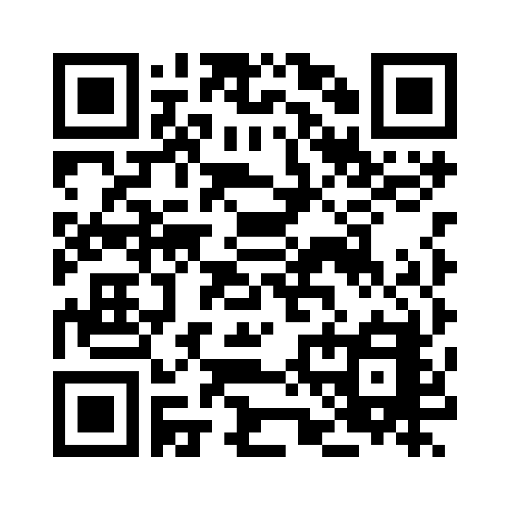

Thank you for taking time to fill in the 
mid-term evaluation!

From Analytics to Action
26
Date

Technical University of Denmark

---

<!-- Slide 27 -->