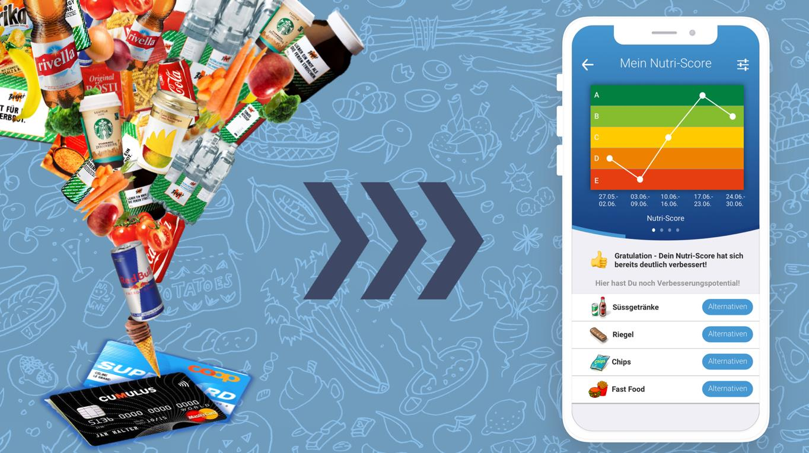
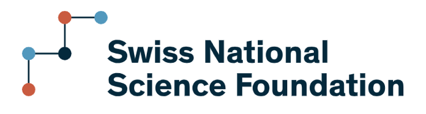
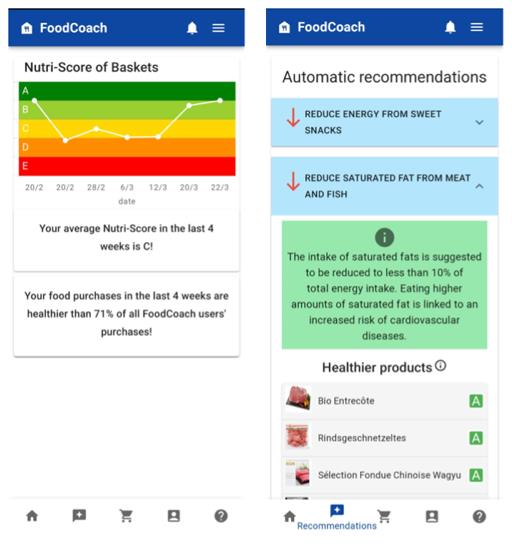
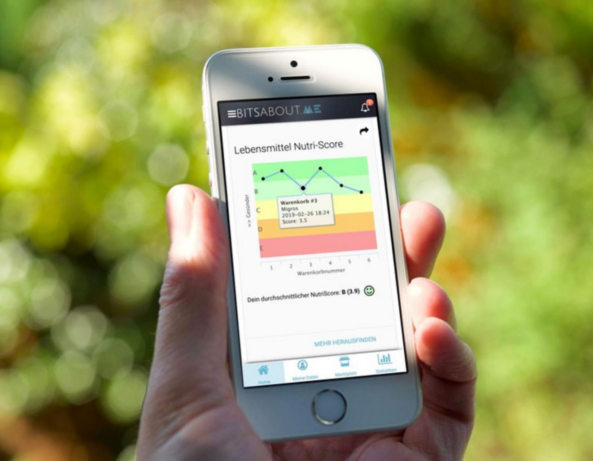

<!-- Slide 1 -->

Challenges in the data economy: Resistance in the data-driven 
society

From Analytics to 
Action

From Analytics to Action
1
13 April, 2026

Technical University of Denmark

---

<!-- Slide 2 -->

Thank you for filling in the mid-term evaluation!

Suggestions/ideas from you:

Reading seminar: change to more problem-solving oriented or group work

Cases: scope, data, analysis, deadlines.

Weekly quizzes on readings/concepts.

Consultations with TAs and groups

And thank you for the positive feedback, too!

Technical University of Denmark

From Analytics to Action
2

---

<!-- Slide 3 -->

Today: Resistance in the data-driven society

• Learning objectives 4 and 7
Compare and assess potential pitfalls 
and barriers for the project; 
Discuss the project's possible 
consequences for the market and 
organisation.

• Concepts from texts.
• Resistance, defensive and productive 
• Resistance tactics
• Meaningless work

• Understand what “resistance” means in 
data-driven society 
• Recognize how datafication reshapes 
professional knowledge and judgement
• Identify forms of resistance within 
technical systems and workplaces

Technical University of Denmark

From Analytics to Action
3

---

<!-- Slide 4 -->

Describe a situation where a digital system 
forced you to act in a way that felt wrong, 
inefficient, or meaningless.

Technical University of Denmark

From Analytics to Action
4

---

<!-- Slide 5 -->

Resistance and its goals

• Resistance = “intentional actions taken 
in opposition to someone or something, 
arising from a refusal to conform to social 
norms or accept the status quo (or 
changes to it). It can vary in both the 
visibility of the act itself and the degree of 
intent or consciousness behind it 
(Hollander & Einwohner, 2004).” (Milan, 
2024: 2)

• Goal of resistance is “to challenge 
structural conditions of injustice and 
inequality, such as laws, state authority, 
and other forms of power perceived as 
unjust.” (Milan, 2024: 2)

Technical University of Denmark

From Analytics to Action
5

---

<!-- Slide 6 -->

Resistance and its relevance for data scientists

Where does resistance happen?
• In data collection (what people choose to share) 
• In data generation (how they behave because of systems) 
• In system interaction (workarounds, etc.)

Why does resistance happen?
• Because data systems a) simplify reality, b) enforce categories, and c) reward certain 
behaviours over others. → People push back when this clashes with lived reality

Why should you care?
• Resistance degrades data quality 
• It produces misleading outputs 
• It also signals misalignment between system and reality/values.

Technical University of Denmark

From Analytics to Action
6

---

<!-- Slide 7 -->

Resistance in the data-driven society (Milan, 2024: 
3)

Structure of the article:
1. Historical overview of the evolution of resistance. 
2. Three key transformations in resistance within a data-driven society:

infrastructure, political agency, and tactics. 
3. Six effective resistance tactics for addressing the challenges of datafication

Main argument:
“This essay argues that the progressive digitalisation and datafication of society, 
coupled with the rise of intelligent systems (or artificial intelligence, henceforth AI), 
have fundamentally reshaped the possibilities for resistance.”

Technical University of Denmark

From Analytics to Action
7

---

<!-- Slide 8 -->

Resistance to datafication

• Defensive resistance:
1. Self-defence
2. Subversion
3. Avoidance (impractical as

• Productive resistance:
1. Literacy
2. Counter-imagination
3. Advocacy campaigning

essential services like identity 
verification require smartphone and 
app)

Overall challenge: Expertise needed to resist harms of data-driven 
society and ability to confront complexity in matters of concerns.

Technical University of Denmark

From Analytics to Action
8

---

<!-- Slide 9 -->

Data activism (Milan, 2022)

• “Data activism represents an emerging form of collective action that 
invites citizens to take a critical approach toward massive data 
collection.”

• Examples of data activists: 
• Human rights defenders seeking to protect dissidents from government 
surveillance
• Environmental activists keeping an independent record of forest depletion
• Non-governmental organizations meticulously recording cases of police 
violence against racialized subjects or domestic abuse
• “Civic hackers” appropriating government data for advocacy purposes

Technical University of Denmark

From Analytics to Action
9

---

<!-- Slide 10 -->

Example 1: FoodCoach research project (2020-2024)

•
Interdisciplinary research project
•
Digital health: healthy food shopping
and consumption
•
Customer loyalty data: Automated
analysis of digital shopping receipts
•
Progressive web app: Information is
made available to users

10

Technical University of Denmark

---

<!-- Slide 11 -->

FoodCoach Vision: Interventions to change shopping 
behaviour using digital receipts and food composition 
databases

FoodCoach receives

User receives 
feedback within 
FoodCoach

item log and

nutritional 
information

User learns 
and improves 
consumption 
habits

Basket Data is 
synced at Digital

Receipt Service

Automated 
Feedback Loops

FoodCoach Users*
* User (= only after explicit opt-in 
consent)

FoodCoach App

Progressive Web

Shopping Journey

App

User scans 
Loyalty Card at

User shops at 
Retailer

Store

Technical University of Denmark

---

<!-- Slide 12 -->

FoodCoach – social science team

Accompanying the design and 
development phases of the FoodCoach 
app and integrating user and non-user 
perspectives.

Identify motivations, intentions, drivers 
and barriers of potential users and non-
users in relation to digital receipt-based 
nutrition monitoring

Understanding new or evolving social 
norms of food and digital health.

Technical University of Denmark

12

---

<!-- Slide 13 -->

FoodCoach: Fully Automated Diet Counselling

• ”Unhealthy dietary habits are a major preventable risk factor 
for widespread non-communicable diseases (NCD). Diet 
counseling is effective in managing diet-related NCDs, but 
constrained by its manual nature and limited (clinical) 
resources. To address these challenges, we propose a fully 
automated diet counseling system FoodCoach. It monitors 
people's food purchases using digital receipts from loyalty 
cards and provides structured dietary recommendations. We 
introduce the FoodCoach system's recommender algorithm 
and architecture, along with evaluation results from a two-arm 
randomized controlled trial involving 61 participants. The trial 
results demonstrate the technical feasibility and potential 
for scalable, fully automated diet counseling, despite not 
showing a significant change in participants' food purchase 
healthiness.” (Wu et al., 2025: abstract excerpt)

Technical University of Denmark

13

---

<!-- Slide 14 -->

Lived experiences of digital food tracking

Uses and non-uses of food purchasing data and dietary tracking apps: Living with, beyond, against 
and despite of them:
•
How do people engage or not with mundane food data and technologies (e.g., Kennedy 2018, Lupton 
2016, Pink et a. 2017, Hyysalo et al. 2016)

Uses:

•
To get informed
•
To become aware
•
Embodiment though time and sense of empowerment
•
Undesirable side effects: excessive self-control, negative feelings (guilty, frustration, disappointment)

Ways of engaging: Playing, cheating and challenging with, addicted to

Non-uses:

•
Beyond: abandoning the use after a certain period of time
•
Against: persons who ”want not” and “resist” their use
•
Despite of: persons who are “socially” or “technically” excluded by their use

14

Technical University of Denmark

---

<!-- Slide 15 -->

Activity (in groups of 3-4): Design, Break, 
Resistance (1/2)

• You are designing a system to evaluate delivery 
driver performance using data.
The company wants a simple, scalable metric to 
optimize productivity.

• Task 1: Design a performance system:
– What data do you collect? 
– What metrics do you use? 
– What counts as “good performance”?

• Task 2: Break the performance system (from 
perspective of delivery driver):

– How would you game or work around the system? 
– What would you ignore or stop doing?
– What becomes “meaningless work”?

Technical University of Denmark

15

---

<!-- Slide 16 -->

Activity (in groups of 3-4): Design, Break, 
Resistance (2/2)

• You are designing a system to evaluate delivery 
driver performance using data.
The company wants a simple, scalable metric to 
optimize productivity.

• Task 3: Discuss resistance:
– What is being resisted and why?
– What does the system fail to capture?
– What kind of work becomes invisible?

• Task 4: Debrief – share in class

• Reflection: If you were redesigning the system, what 
would you change?

Technical University of Denmark

16

---

<!-- Slide 17 -->

Example 2: MyData

• MyData is a global movement encouraging individual 
empowerment around personal data.

• Originated in Finland as a response to asymmetries in how data 
and the means of knowledge production are distributed.

• Aims to shape a more sustainable citizen-centric data economy by 
means of increasing individuals’ control of their personal data.

Technical University of Denmark

From Analytics to Action
17

---

<!-- Slide 18 -->

Example 3: 
Hestia Labs and data collectives (1/2)

“At HestiaLabs, we dream of a digital world where users take back

control over their data. A digital world where the benefits 
generated by data processing are shared with those who 
produce them. A digital world where service providers and users

decide together which data will be used and for what purpose. A

digital world where transparency is the norm.”

(Source: Hestialabs.org/en/strategy)

Examples: Dating privacy tools for dating app users to understand 
how their data is used. The Eyeballs reveals invisible trackers that 
observe, record and analyse everything you do online.

Technical University of Denmark

From Analytics to Action
18

---

<!-- Slide 19 -->

Example: 
Hestia Labs and data collectives (2/2)

Governing work through personal data: The case of Uber drivers in 
Geneva (Pidoux, Dehaye, and Gursky)

• Gig workers use data access rights (GDPR) to challenge platform control over 
their work
• Platform data is hard to interpret: requires technical expertise to make it usable
• Algorithmic management governs pricing, work allocation, and earnings
• Collective data analysis enables worker-led “algorithm auditing”
• Data reveals discrepancies between actual work and paid work: exposing 
inequalities and supporting legal/political claims (employees)

From Analytics to Action
19
Link: https://firstmonday.org/ojs/index.php/fm/article/download/13576/11403

Technical University of Denmark

---

<!-- Slide 20 -->

What forms of resistance to datafication 
can you envision related to the cases you 
work on (Rigshospitalet, Will & Agency)?

Technical University of Denmark

From Analytics to Action
20

---

<!-- Slide 21 -->

‘Meaningless work’ (Hoeyer and Wadmann, 2020)

• The article explores how datafication and 
digitalizatiaon influence work and goal 
orientation among professionals in 
contemporary public organizations (p. 434)

• Experiences of meaningless work partly 
result from technologically mediated ways of 
making sense of work (p. 435)

• Organizational environment creating 
interconnectedness through data: being seen 
and recognized as doing important work of 
sufficient quality implies the use of standardized 
data that can travel across contexts (p. 444)

Technical University of Denmark

From Analytics to Action
21

---

<!-- Slide 22 -->

Implications of meaningless work

• Financial costs

• Epistemic doubt

• A changed moral landscape: changing work culture and priorities of 
clinical attention: “‘Good data’  are no longer justified with reference 
to their support of clinical outcome” (p. 447)

Technical University of Denmark

From Analytics to Action
22

---

<!-- Slide 23 -->

“Datafication might do most harm when 
people believe too much in data and forget 
to retain room for judgement.” p. 449

Technical University of Denmark

From Analytics to Action
23

---

<!-- Slide 24 -->

Synthesis: Where resistance happens

1. Levels of resistance
• Individual (workarounds, ignoring systems)
• Organizational (collective pushback)
• Technical (design choices, system architecture)

2. Targets of resistance
• Data collection
• Data interpretation
• Algorithmic decision-making

3. Motivations
• Protect autonomy
• Preserve meaning
• Contest unfair systems

Technical University of Denmark

From Analytics to Action
24

---

<!-- Slide 25 -->

What could count as meaningless work 
related to datafication be in the case of 
Rigshospitalet and Will & Agency?

Technical University of Denmark

From Analytics to Action
25