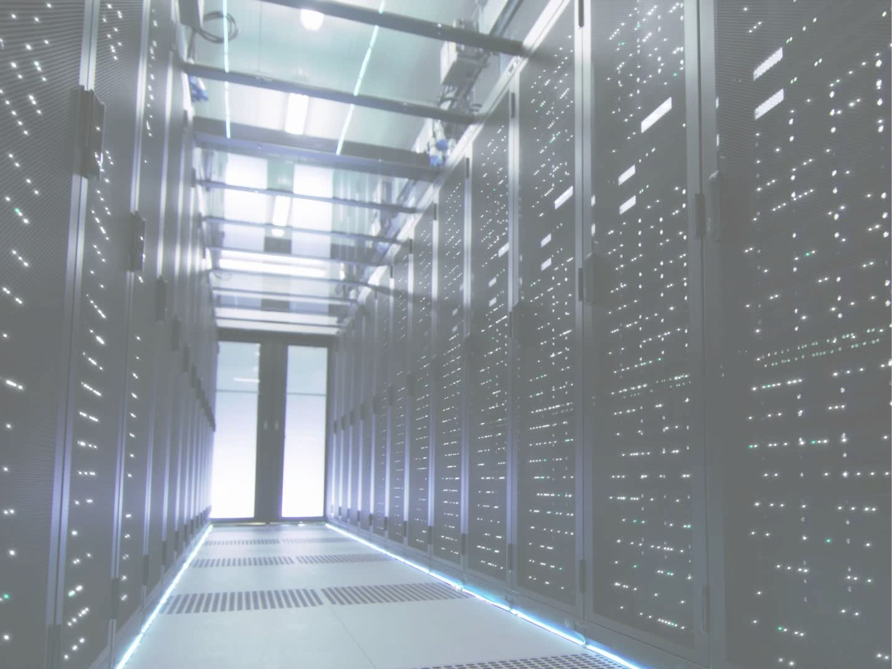
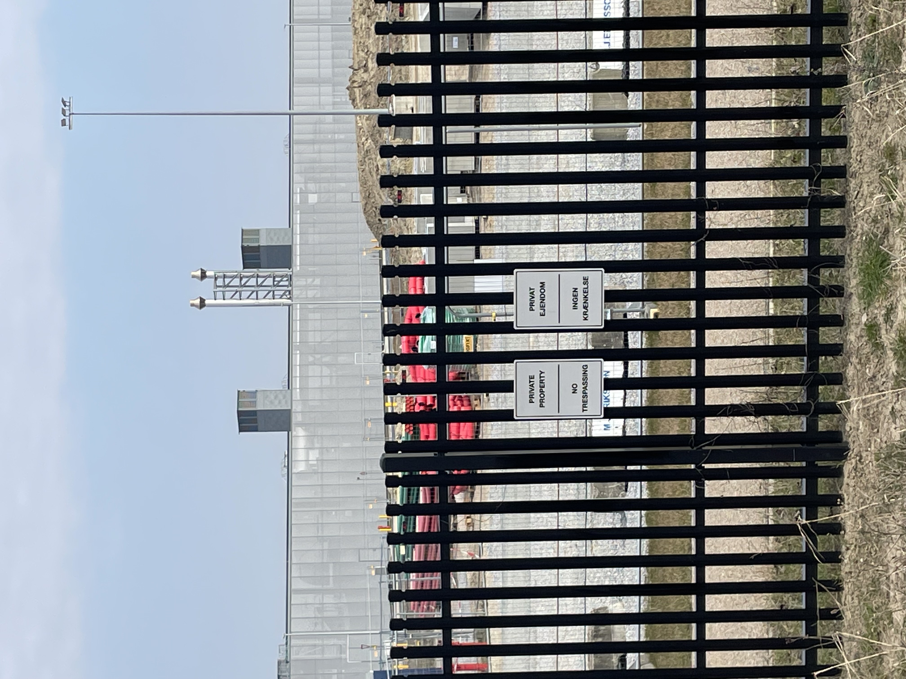
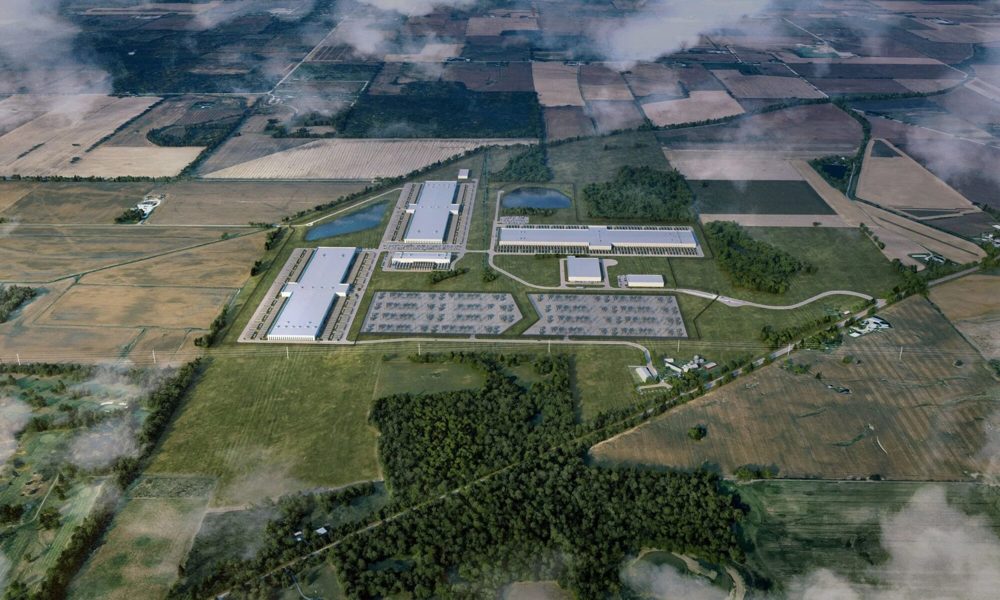
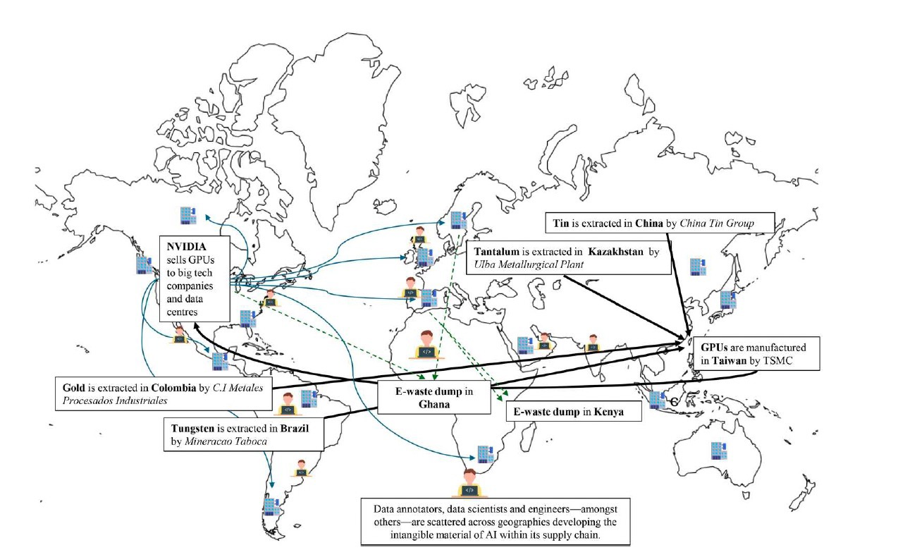
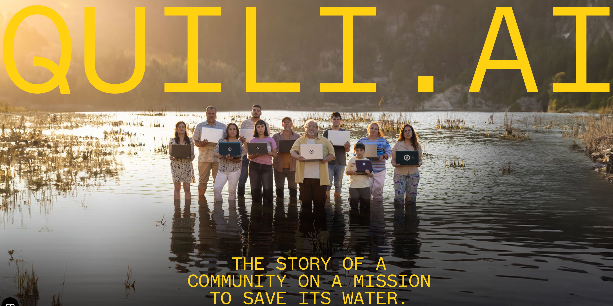
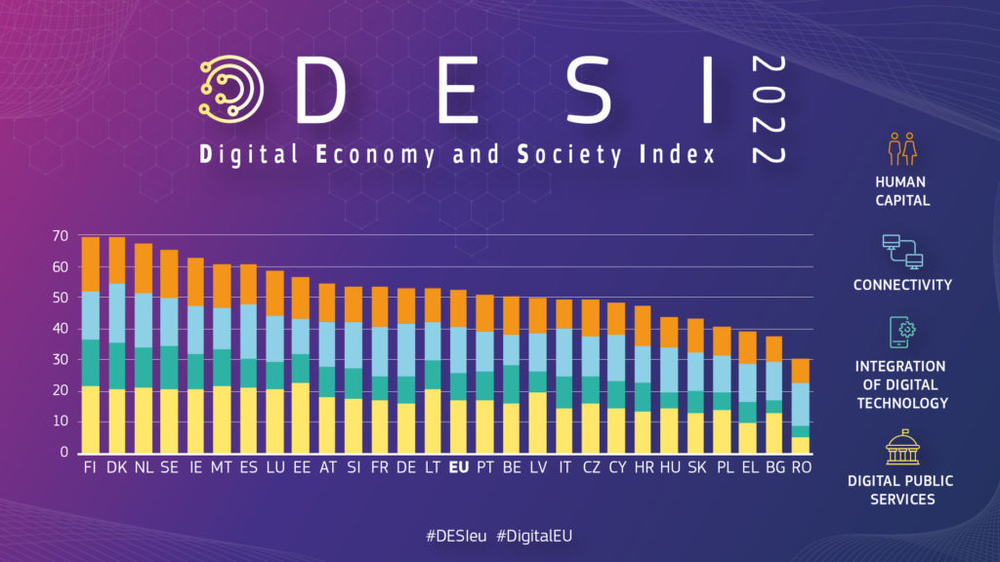
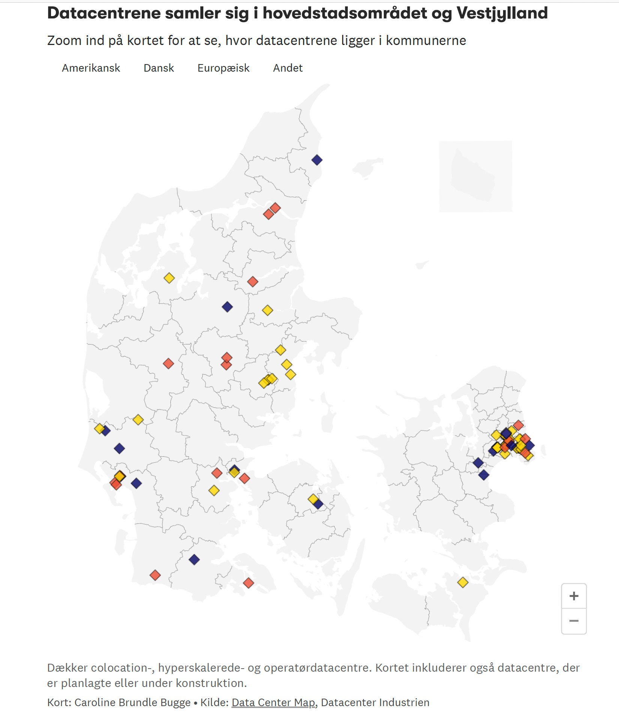
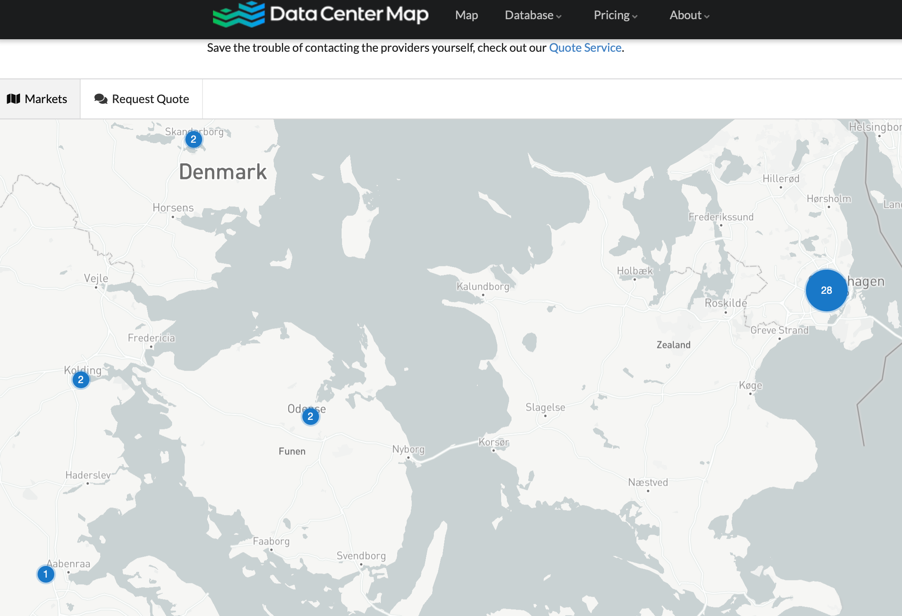
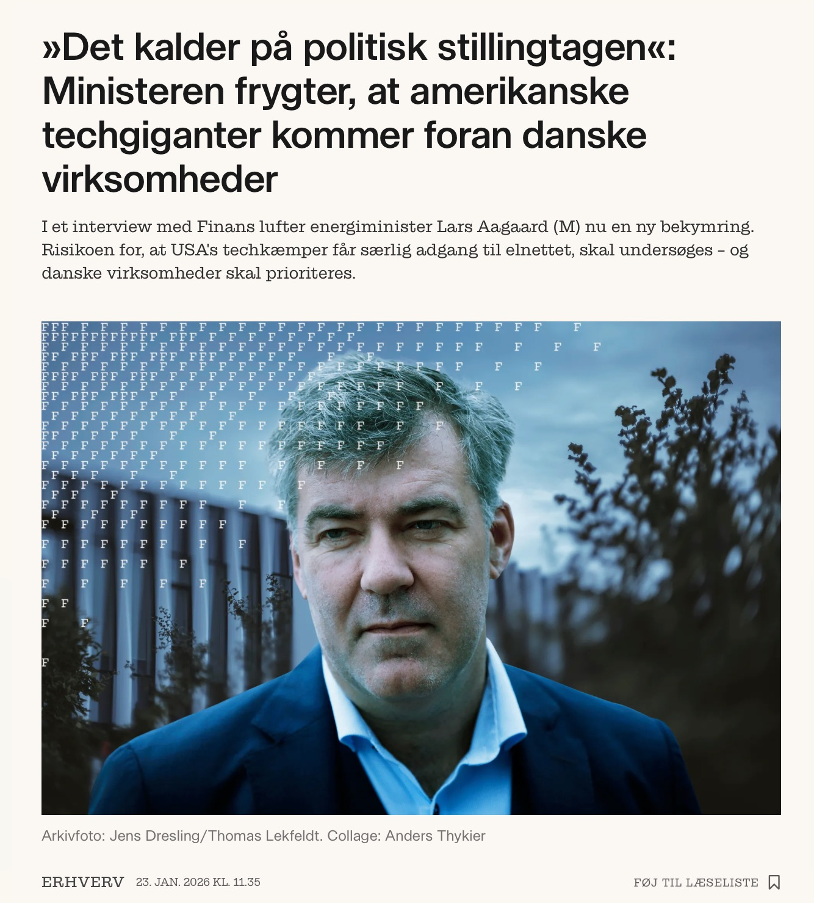
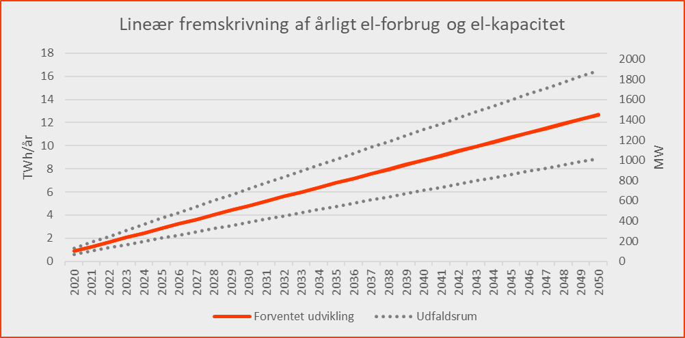

<!-- Slide 1 -->

Data’s environmental impact:
The hidden costs of datafication,

storage and analysis

Brit Ross Winthereik, professor

Dept of Technology, Management and Economics, DTU

---

<!-- Slide 2 -->

Learning objectives

• Understand data as a material system
• Identify environmental impacts
• Apply supply chain capitalism and algorithmic 
harm
• Reflect on responsibility issues

---

<!-- Slide 3 -->

Opening question

• Where is your data right now?
• Why whould you bother?

---

<!-- Slide 4 -->

Data is always produced, 
processed, and placed 
somewhere

---

<!-- Slide 5 -->

Source: Valdivia, Ana. 2024. “The Supply Chain Capitalism of AI: A Call to (Re)Think 
Algorithmic Harms and Resistance through Environmental Lens.” Information 
Communication and Society.

---

<!-- Slide 6 -->

Quiz 1 – Supply chain capitalism

• The meaning of the concept?
1. Capitalism works the same way everywhere
2. Firms control all production directly
3. Global capitalism is made up of very different

labour, laws, and conditions
4. Technology removes inequality from markets

---

<!-- Slide 7 -->

Quiz 1 Debrief

• Low cost and flexibility is built into the system, 
but there are other costs
• Low paid workers carry risk while firms
capture value
• Hetergeneity not equal to fairness

---

<!-- Slide 8 -->

Key tension in data’s supply chain

• Collection
• Organization
• Processing
• Storage
• Delivery

ØGlobal vs local
ØCompeting interests and values

---

<!-- Slide 9 -->

Anthropological study

• Apple in Viborg (2017-2020)
• Meta in Odense (2019-2023)
• Microsoft in Eastern and Western Denmark 
(2024- )

Salling, Caroline Anna, and Brit Ross Winthereik. 2025. “Inventorying Data: 
Circumvented Investment Conditions by Big Tech’s Supply Chain Capitalism.” Journal of 
Cultural Economy.

Maguire, James, and Brit Ross Winthereik. 2021. “Digitalizing the State: Data Centres 
and the Power of Exchange.” Ethnos 86 (3): 530–51.

---

<!-- Slide 10 -->

Hyperscale data centers - size

• 5000+ servers
• Minimum of 10.000 square feet/930 square 
meters/1 ha
• Minimum 40 MW of capacity

---

<!-- Slide 11 -->

Hyperscale data centers - capacity

• Elastic computing: The ability to quickly 
expand or decrease computer processing, 
memory, and storage resources to meet 
changing demands
• Hyperscalers mirror data by maintaining exact 
copies across multiple locations

---

<!-- Slide 12 -->

Key insight

• Data centers form 
the infrastructural 
backbone of the 
digital society, but 
their operation puts 
pressure on local 
environments

---

<!-- Slide 13 -->

Environmental impact

• Water usage – emptying of aquafers, rising 
prices for residents
• Energy consumption – pressure on electricity 
infrastructure, putting climate action to a halt
• Air pollution – reliance on back up diesel 
generators
• Noise pollution – humming servers
• Light pollution – security

---

<!-- Slide 14 -->

---

<!-- Slide 15 -->

Quiz 2 – Algorithmic harm

What is algorithmic harm?
1. When algorithms are trained on biased data
2. When the automation of decisions cause 
harm to people, because the data is biased
3. When the use of algorithms cause harm to 
individuals, communities and environments
4. When algorithms make mistakes

---

<!-- Slide 16 -->

Quiz 2 Debrief

• Algorithmic impact is distributed
• It is about the data and bias in data, but not 
only
• Algorithmic harm must be considered across
data’s supply chain
• Quili.ai as an example of distributed impact
that has negative consequences

---

<!-- Slide 17 -->

Case: Denmark

• Highly digitalized
• Data center expansion due to cool climate and 
security concerns

---

<!-- Slide 18 -->

Data centers in Denmark

70 hyperscalers and 12 in process

---

<!-- Slide 19 -->

Promises by the industry

• Jobs
• New investments due to the ”AI revolution”
• Data security

---

<!-- Slide 20 -->

Job creation

Apple’s data center, 300 jobs during 
construction (government estimate), 80 
operational jobs expected
Reality after opening in 2020: Only a few small 
companies moved to the area, Apple initially 
planned 50 operational staff, with a long-term 
plan of up to 150
By 2025: 8 employees at the data center

---

<!-- Slide 21 -->

Concerns regarding pressure on the

energy infrastructure

In DK min. 55% of the energy supply must come from renewable sources. If the demand 
increases due to data centres, and renewable energy supply cannot be secured, it will 
threaten society’s green transition.

---

<!-- Slide 22 -->

AI and productivity gains

• Analysis from the Danish National Bank
• “Examples of large productivity gains from using 
AI for certain types of tasks, such as programming 
and translation. Several international studies 
predict that AI will also contribute positively to 
productivity growth in the economy as a whole in 
the coming years. However, the extent of the 
effect is uncertain and varies across countries. It 
is also uncertain when the impact of AI will be 
realised in productivity figures.

Source: https://www.nationalbanken.dk/en/news-and-
knowledge/publications-and-speeches/analysis/2026/artificial-intelligence-
can-boost-productivity-in-the-danish-economy

---

<!-- Slide 23 -->

Water

• Hyperscalers use water for cooling of servers
• They use drinking water
• In DK the drinking water supply is under 
pressure due to effects of industrial 
agriculture (PFAS and other substance)

---

<!-- Slide 24 -->

Excess heat

• Hyperscalers can and have been connected to 
district heating to reduce carbon emissions.
• The heat they produce must be treated futher 
– public investment
• The supply is not guaranteed

---

<!-- Slide 25 -->

The citizen perspective

• Citizens have so far not been provided with 
much information
• Placement is a “technical issue” that 
removes sustainability and other issues 
away from public scrutiny
• 2026: Citizen meetings and hearings across 
Denmark

---

<!-- Slide 26 -->

Hearing responses - a range of

emotions

Anxiety

"meget røvrendte" (feeling screwed over)
Frustration

"tromlet over" (steamrolled), Microsoft "ligeglade med os" (doesn't care about 
us)
Powerlessness

"den store fejl" (the big mistake)
Indignation

"SKAM JER!!!!" (multiple exclamation marks)
Sadness

"knust indeni" (crushed inside)
Loss

"livsværk ødelægges" (life's work destroyed), 40 years of farming, "mit hjem" (my 
home), home as "resultat af mange års arbejde" (result of many years' work)
Fear

"søvnløse nætter" (sleepless nights), "general belastning" (general burden)

---

<!-- Slide 27 -->

Sociotechnical lens

• Data center issues are composed by social, 
technical and political elements
• Engineering work is embedded in global 
power relations

– Architecture
– Infrastructure
– Efficiency
– Data use???

---

<!-- Slide 28 -->

Quiz 3 - Responsibility

• Why does supply chain capitalism make 
responsibility harder to assign?
1. Products are too complex
2. Firms outsource production to legally distant

suppliers
3. Workers choose unsafe jobs freely
4. Governments control everything

---

<!-- Slide 29 -->

Quiz 3 Debrief

• Best ways to reduce harm induced by data 
centers?

---

<!-- Slide 30 -->

Reminder

• Technology is socially embedded
• Data is infrastructurally distributed and 
physically located
• Datafication, storage and data analysis 
negatively impacts environments

---

<!-- Slide 31 -->

Reflection

• How would you design differently?

